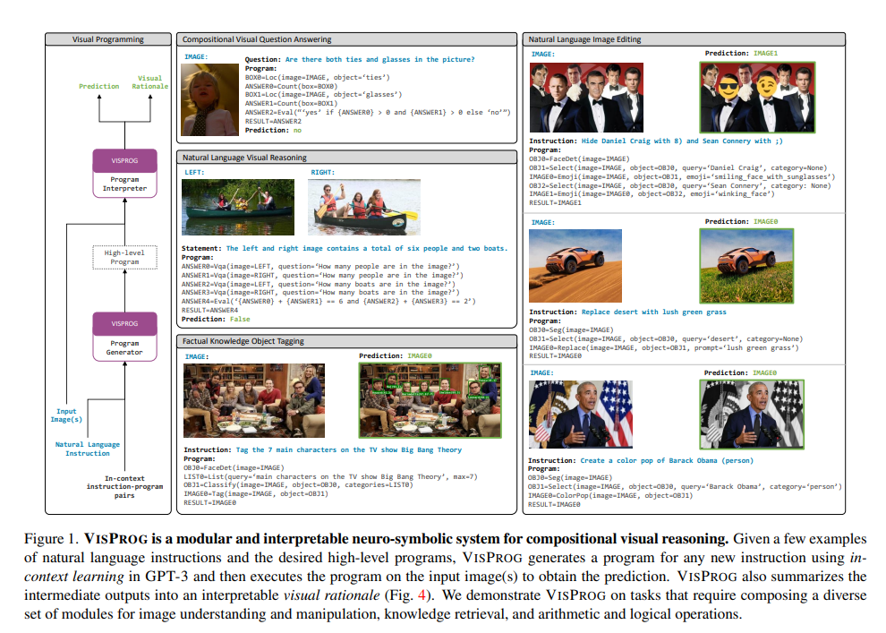
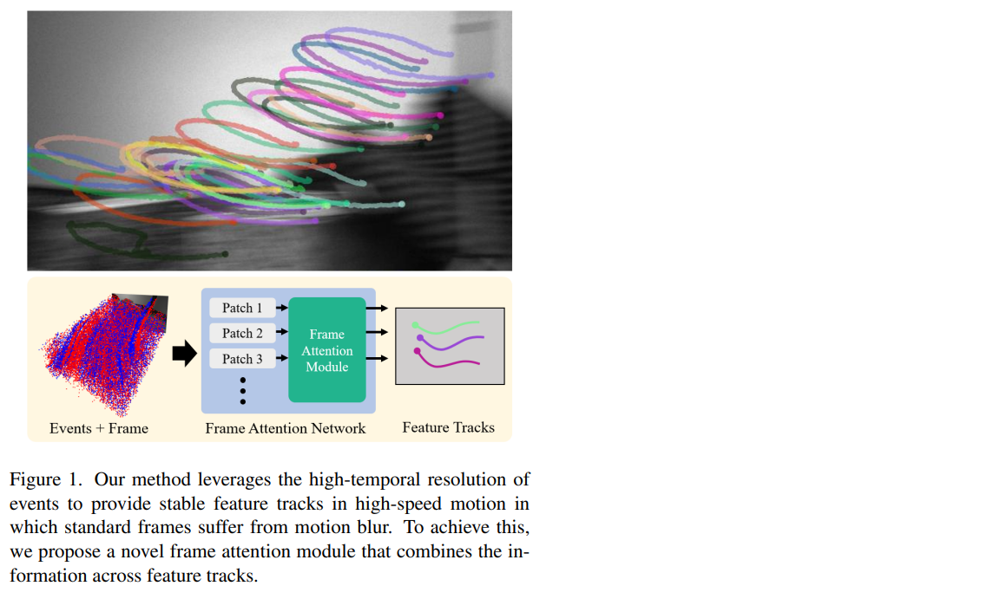
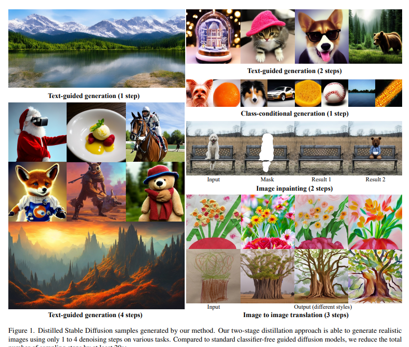
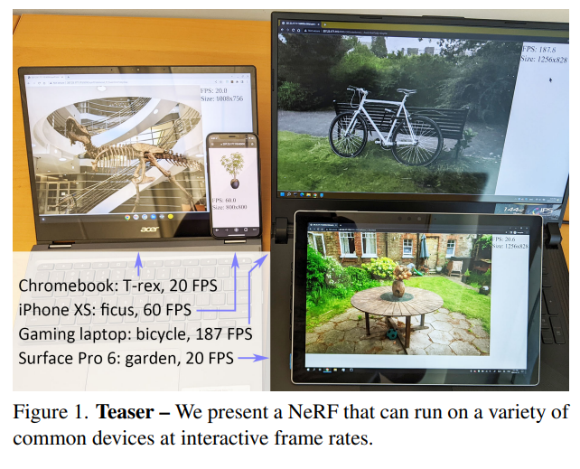
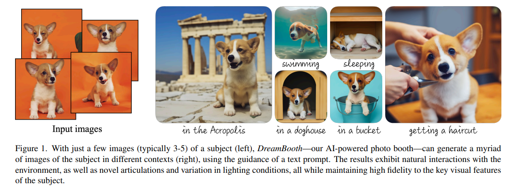

# 2023년 CVPR 주요 논문 분석 [상 받을 후보]

CVPR 2023에서 상을 받을 후보로 제공된 논문을 바탕으로 컴퓨터 비전 연구에서의 추세를 몇가지 식별할 수 있습니다.

## 1. 신경-기호적 접근법(Neuro-symbolic approaches): 'Visual Programming: Compositional Visual Reasoning Without Training'

해당 논문에서는 VISPROG이라는 신경-기호적 접근법을 소개하고 있습니다.

이 방법은 대형 언어 모델을 사용하여 복잡한 시각적 작업을 해결하기 위한 파이썬과 같은 모듈식 프로그램을 생성합니다.

이 추세는 **신경 네트워크와 기호적 추론을 결합**하여 시각적 추론 능력을 향상시키는 탐색을 제안합니다.

[논문 보기](https://openaccess.thecvf.com/content/CVPR2023/html/Gupta_Visual_Programming_Compositional_Visual_Reasoning_Without_Training_CVPR_2023_paper.html)

##### Abstract

We present VISPROG, a neuro-symbolic approach to solving complex and compositional visual tasks given natural language instructions. VISPROG avoids the need for any task-specific training. Instead, it uses the in-context learning ability of large language models to generate python-like modular programs, which are then executed to get both the solution and a comprehensive and interpretable rationale. Each line of the generated program may invoke one of several off-the-shelf computer vision models, image processing routines, or python functions to produce intermediate outputs that may be consumed by subsequent parts of the program. We demonstrate the flexibility of VISPROG on 4 diverse tasks - compositional visual question answering, zero-shot reasoning on image pairs, factual knowledge object tagging, and language-guided image editing. We believe neuro-symbolic approaches like VISPROG are an exciting avenue to easily and effectively expand the scope of AI systems to serve the long tail of complex tasks that people may wish to perform.

## 2. 데이터 기반 방법(Data-driven methods): 'Data-Driven Feature Tracking for Event Cameras'

해당 논문에서는 이벤트 카메라를 위한 데이터 기반 특징 추적 방법을 제시하고 있습니다.

이 방법은 저지연 이벤트를 활용하고 합성 데이터에서 실제 데이터로 지식을 전달합니다. 이 추세는 대량의 데이터를 활용하고 이로부터 학습하여 성능과 일반화를 향상시키는 것에 초점을 맞추고 있습니다.

[논문 보기](https://openaccess.thecvf.com/content/CVPR2023/html/Messikommer_Data-Driven_Feature_Tracking_for_Event_Cameras_CVPR_2023_paper.html)

##### Abstract

Because of their high temporal resolution, increased resilience to motion blur, and very sparse output, event cameras have been shown to be ideal for low-latency and low-bandwidth feature tracking, even in challenging scenarios. Existing feature tracking methods for event cameras are either handcrafted or derived from first principles but require extensive parameter tuning, are sensitive to noise, and do not generalize to different scenarios due to unmodeled effects. To tackle these deficiencies, we introduce the first data-driven feature tracker for event cameras, which leverages low-latency events to track features detected in a grayscale frame. We achieve robust performance via a novel frame attention module, which shares information across feature tracks. By directly transferring zero-shot from synthetic to real data, our data-driven tracker outperforms existing approaches in relative feature age by up to 120% while also achieving the lowest latency. This performance gap is further increased to 130% by adapting our tracker to real data with a novel self-supervision strategy.

## 3. 효율적인 생성 모델(Efficient generation models): 'On Distillation of Guided Diffusion Models'와 'MobileNeRF: Exploiting the Polygon Rasterization Pipeline for Efficient Neural Field Rendering on Mobile Architectures'

두 논문은 이미지 생성 모델의 효율성을 다룹니다. 이들은 샘플링 과정을 가속화하고 이러한 모델을 더 실용적이고 접근 가능하게 만들기 위한 증류 방법과 대체 표현을 제안합니다.

[논문 보기](https://openaccess.thecvf.com/content/CVPR2023/html/Meng_On_Distillation_of_Guided_Diffusion_Models_CVPR_2023_paper.html)

##### Abstract

Classifier-free guided diffusion models have recently been shown to be highly effective at high-resolution image generation, and they have been widely used in large-scale diffusion frameworks including DALL\*E 2, Stable Diffusion and Imagen. However, a downside of classifier-free guided diffusion models is that they are computationally expensive at inference time since they require evaluating two diffusion models, a class-conditional model and an unconditional model, tens to hundreds of times. To deal with this limitation, we propose an approach to distilling classifier-free guided diffusion models into models that are fast to sample from: Given a pre-trained classifier-free guided model, we first learn a single model to match the output of the combined conditional and unconditional models, and then we progressively distill that model to a diffusion model that requires much fewer sampling steps. For standard diffusion models trained on the pixel-space, our approach is able to generate images visually comparable to that of the original model using as few as 4 sampling steps on ImageNet 64x64 and CIFAR-10, achieving FID/IS scores comparable to that of the original model while being up to 256 times faster to sample from. For diffusion models trained on the latent-space (e.g., Stable Diffusion), our approach is able to generate high-fidelity images using as few as 1 to 4 denoising steps, accelerating inference by at least 10-fold compared to existing methods on ImageNet 256x256 and LAION datasets. We further demonstrate the effectiveness of our approach on text-guided image editing and inpainting, where our distilled model is able to generate high-quality results using as few as 2-4 denoising steps.

[논문 보기](https://openaccess.thecvf.com/content/CVPR2023/html/Chen_MobileNeRF_Exploiting_the_Polygon_Rasterization_Pipeline_for_Efficient_Neural_Field_CVPR_2023_paper.html)

##### Abstract

Neural Radiance Fields (NeRFs) have demonstrated amazing ability to synthesize images of 3D scenes from novel views. However, they rely upon specialized volumetric rendering algorithms based on ray marching that are mismatched to the capabilities of widely deployed graphics hardware. This paper introduces a new NeRF representation based on textured polygons that can synthesize novel images efficiently with standard rendering pipelines. The NeRF is represented as a set of polygons with textures representing binary opacities and feature vectors. Traditional rendering of the polygons with a z-buffer yields an image with features at every pixel, which are interpreted by a small, view-dependent MLP running in a fragment shader to produce a final pixel color. This approach enables NeRFs to be rendered with the traditional polygon rasterization pipeline, which provides massive pixel-level parallelism, achieving interactive frame rates on a wide range of compute platforms, including mobile phones.

## 4. 문맥 인식 렌더링 및 합성(Context-aware rendering and synthesis): 'DreamBooth: Fine Tuning Text-to-Image Diffusion Models for Subject-Driven Generation'과 'DynlBaR: Neural Dynamic Image-Based Rendering'

해당 논문들은 각각 텍스트 프롬프트에서 이미지의 합성을 향상시키고 비디오에서 새로운 뷰를 생성하는 데 초점을 맞추고 있습니다.

이 논문들은 이미지 합성과 렌더링 작업에서 문맥 정보와 동적 장면 이해의 중요성을 강조합니다.

[논문 보기](https://openaccess.thecvf.com/content/CVPR2023/html/Ruiz_DreamBooth_Fine_Tuning_Text-to-Image_Diffusion_Models_for_Subject-Driven_Generation_CVPR_2023_paper.html)

##### Abstract

Large text-to-image models achieved a remarkable leap in the evolution of AI, enabling high-quality and diverse synthesis of images from a given text prompt. However, these models lack the ability to mimic the appearance of subjects in a given reference set and synthesize novel renditions of them in different contexts. In this work, we present a new approach for "personalization" of text-to-image diffusion models. Given as input just a few images of a subject, we fine-tune a pretrained text-to-image model such that it learns to bind a unique identifier with that specific subject. Once the subject is embedded in the output domain of the model, the unique identifier can be used to synthesize novel photorealistic images of the subject contextualized in different scenes. By leveraging the semantic prior embedded in the model with a new autogenous class-specific prior preservation loss, our technique enables synthesizing the subject in diverse scenes, poses, views and lighting conditions that do not appear in the reference images. We apply our technique to several previously-unassailable tasks, including subject recontextualization, text-guided view synthesis, and artistic rendering, all while preserving the subject's key features. We also provide a new dataset and evaluation protocol for this new task of subject-driven generation. Project page: https://dreambooth.github.io/
