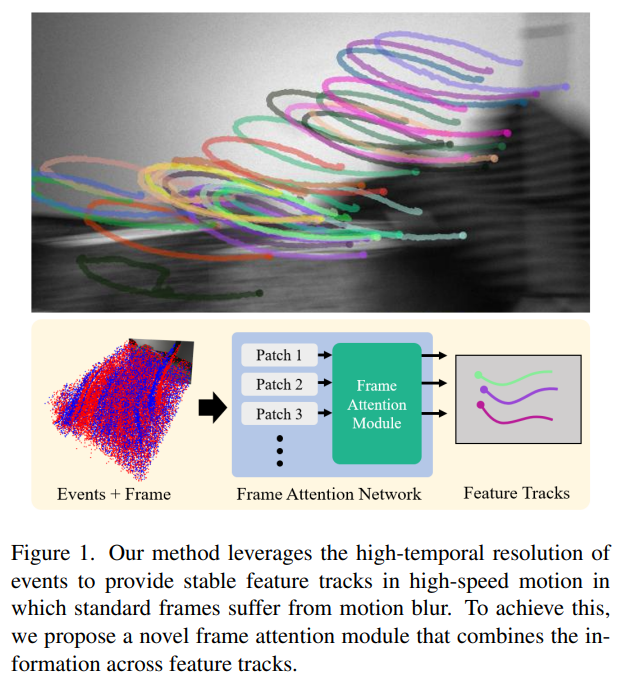

# 2023년 CVPR 주요 논문 분석 [상 받을 후보]

CVPR 2023에서 상을 받을 후보로 제공된 논문을 바탕으로 컴퓨터 비전 연구에서의 추세를 몇가지 식별할 수 있습니다.

## 1. 신경-기호적 접근법: 'Visual Programming: Compositional Visual Reasoning Without Training'

[논문 보기](https://openaccess.thecvf.com/content/CVPR2023/html/Gupta_Visual_Programming_Compositional_Visual_Reasoning_Without_Training_CVPR_2023_paper.html)

해당 논문에서는 VISPROG이라는 신경-기호적 접근법을 소개하고 있습니다.

이 방법은 대형 언어 모델을 사용하여 복잡한 시각적 작업을 해결하기 위한 파이썬과 같은 모듈식 프로그램을 생성합니다.

이 추세는 **신경 네트워크와 기호적 추론을 결합**하여 시각적 추론 능력을 향상시키는 탐색을 제안합니다.

## 2. 데이터 기반 방법: 'Data-Driven Feature Tracking for Event Cameras'

[논문 보기](https://openaccess.thecvf.com/content/CVPR2023/html/Messikommer_Data-Driven_Feature_Tracking_for_Event_Cameras_CVPR_2023_paper.html)

##### Abstract

Because of their high temporal resolution, increased resilience to motion blur, and very sparse output, event cameras have been shown to be ideal for low-latency and low-bandwidth feature tracking, even in challenging scenarios. Existing feature tracking methods for event cameras are either handcrafted or derived from first principles but require extensive parameter tuning, are sensitive to noise, and do not generalize to different scenarios due to unmodeled effects. To tackle these deficiencies, we introduce the first data-driven feature tracker for event cameras, which leverages low-latency events to track features detected in a grayscale frame. We achieve robust performance via a novel frame attention module, which shares information across feature tracks. By directly transferring zero-shot from synthetic to real data, our data-driven tracker outperforms existing approaches in relative feature age by up to 120% while also achieving the lowest latency. This performance gap is further increased to 130% by adapting our tracker to real data with a novel self-supervision strategy.

## 3. 효율적인 생성 모델: 'On Distillation of Guided Diffusion Models'와 'MobileNeRF: Exploiting the Polygon Rasterization Pipeline for Efficient Neural Field Rendering on Mobile Architectures'

[논문 보기](https://openaccess.thecvf.com/content/CVPR2023/html/Meng_On_Distillation_of_Guided_Diffusion_Models_CVPR_2023_paper.html)

[논문 보기](https://openaccess.thecvf.com/content/CVPR2023/html/Chen_MobileNeRF_Exploiting_the_Polygon_Rasterization_Pipeline_for_Efficient_Neural_Field_CVPR_2023_paper.html)
