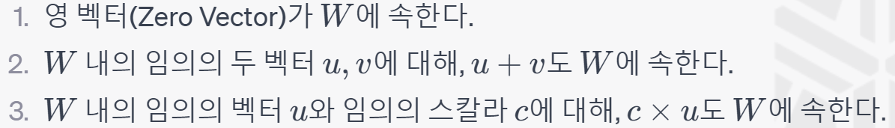

# Subspace

서브스페이스(subspace)는 벡터 공간의 일부분을 이루는 벡터의 집합입니다. 이 서브스페이스는 원래의 벡터 공간에 대한 연산(덧셈, 스칼라 곱 등)을 유지하면서도 자체적으로 벡터 공간의 성질을 가집니다. 즉, 서브스페이스 내의 두 벡터를 더하거나 스칼라로 곱한 결과도 동일한 서브스페이스에 속하게 됩니다.

수학적으로, 어떤 벡터 공간 V에 대해, W가 V의 서브스페이스라면 다음의 조건을 만족해야 합니다:

서브스페이스는 선형 대수학, 머신 러닝, 데이터 분석, 신호 처리 등 다양한 분야에서 활용됩니다. 예를 들어, 주성분 분석(PCA)에서는 데이터의 분산을 최대로 하는 서브스페이스를 찾아 고차원 데이터를 저차원으로 축소합니다. 또한, 도메인 적응이나 메트릭 학습에서는 서브스페이스를 활용하여 다른 도메인이나 메트릭으로 데이터를 변환하기도 합니다.