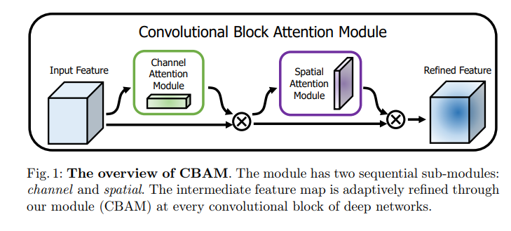
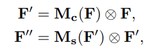
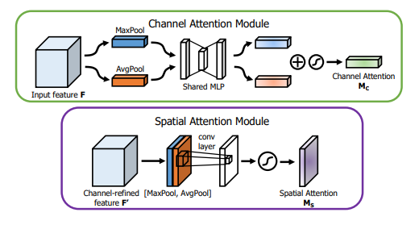
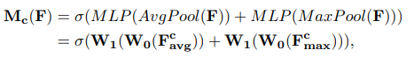
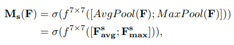
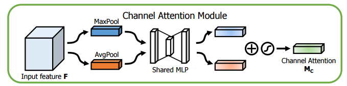
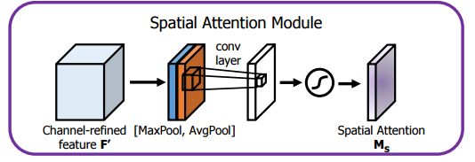

# CBAM: Convolutional Block Attention Module [논문 번역]

[논문 읽으러 가기](https://arxiv.org/abs/1807.06521)

## Abstract

We propose Convolutional Block Attention Module (CBAM),
a simple yet effective attention module for feed-forward convolutional
neural networks. Given an intermediate feature map, our module sequentially infers attention maps along two separate dimensions, channel
and spatial, then the attention maps are multiplied to the input feature
map for adaptive feature refinement. Because CBAM is a lightweight and
general module, it can be integrated into any CNN architectures seamlessly with negligible overheads and is end-to-end trainable along with
base CNNs. We validate our CBAM through extensive experiments on
ImageNet-1K, MS COCO detection, and VOC 2007 detection datasets.
Our experiments show consistent improvements in classification and detection performances with various models, demonstrating the wide applicability of CBAM. The code and models will be publicly available.

Keywords: Object recognition, attention mechanism, gated convolution

우리는 피드포워드 합성곱 신경망에 대한 간단하면서도 효과적인 주의 모듈인 Convolutional Block Attention Module(CBAM)을 제안합니다. 중간 특징 맵이 주어지면, 우리의 모듈은 채널과 공간, 두 가지 별도의 차원을 따라 차례로 주의 맵을 추론하고, 그런 다음 주의 맵이 입력 특징 맵에 곱해져 **적응형 특징 개선**이 이루어집니다. CBAM은 가벼우며 일반적인 모듈이므로, 거의 추가 비용 없이 어떤 CNN 아키텍처에서도 원활하게 통합될 수 있으며 기본 CNN과 함께 끝-끝으로 훈련 가능합니다. 우리는 ImageNet-1K, MS COCO검출, VOC2007 검출 데이터셋에서의 광범위한 실험을 통해 CBAM을 검증합니다. 우리의 실험은 다양한 모델에서의 분류와 검출 성능의 일관된 개선을 보여줌으로써 CBAM의 넓은 적용 가능성을 입증합니다. 코드와 모델은 공개적으로 이용 가능할 것입니다.

## 1. Introduction

Convolutional neural networks (CNNs) have significantly pushed the performance of vision tasks [1,2,3] based on their rich representation power. To enhance performance of CNNs, recent researches have mainly investigated three important factors of networks: depth, width, and cardinality.

합성곱 신경망 (CNNs)은 그들의 풍부한 표현력을 바탕으로 시각 작업의 성능을 크게 향상시켰습니다. CNNs의 성능을 향상시키기 위해, 최근의 연구들은 네트워크의 세 가지 중요한 요소를 주로 조사하였습니다: **깊이**, **너비**, 그리고 **카디널리티**.

From the LeNet architecture [4] to Residual-style Networks [5,6,7,8] so far, the network has become deeper for rich representation. VGGNet [9] shows that stacking blocks with the same shape gives fair results. Following the same spirit, ResNet [5] stacks the same topology of residual blocks along with skip connection to build an extremely deep architecture. GoogLeNet [10] shows that width is another important factor to improve the performance of a model. Zagoruyko and Komodakis [6] propose to increase the width of a network based on the ResNet architecture. They have shown that a 28-layer ResNet with increased width can outperform an extremely deep ResNet with 1001 layers on the CIFAR benchmarks. Xception [11] and ResNeXt [7] come up with to increase the cardinality of a network. They empirically show that cardinality not only saves the total number of parameters but also results in stronger representation power than the other two factors: depth and width.

LeNet 아키텍처 부터 지금까지의 잔여 스타일 네트워크 까지, 네트워크는 풍부한 표현력을 위해 점점 깊어졌습니다. VGGNet은 같은 형태의 블록을 쌓는 것이 공정한 결과를 가져온다는 것을 보여줍니다. 같은 정신을 이어, ResNet은 스킵 연결을 동반한 동일한 토폴로지의 잔차 블록을 쌓아 매우 깊은 아키텍처를 구축합니다. GoogLeNet은 너비가 모델의 성능을 향상시키는 또 다른 중요한 요소임을 보여줍니다. Zagoruyko와 Komodakis는 ResNet 아키텍처를 기반으로 네트워크의 너비를 늘리는 것을 제안합니다. 그들은 너비를 늘린 28 계층의 ResNet이 CIFAR 벤치마크에서 1001 계층의 매우 깊은 ResNet을 능가할 수 있다는 것을 보여주었습니다. Xception과 ResNeXt는 네트워크의 카디널리티를 늘리는 것을 제안합니다. 그들은 카디널리티가 매개변수의 전체 수를 절약하는 것뿐만 아니라 깊이와 너비와 같은 다른 두 요소보다 더 강한 표현력을 가져다 준다는 것을 실증적으로 보여줍니다.

Apart from these factors, we investigate a different aspect of the architecture design, attention. The significance of attention has been studied extensively in the previous literature [12,13,14,15,16,17]. Attention not only tells where to focus, it also improves the representation of interests. Our goal is to increase representation power by using attention mechanism: focusing on important features and suppressing unnecessary ones. In this paper, we propose a new network module, named “Convolutional Block Attention Module”. Since convolution operations extract informative features by blending cross-channel and spatial information together, we adopt our module to emphasize meaningful features along those two principal dimensions: channel and spatial axes. To achieve this, we sequentially apply channel and spatial attention modules (as shown in Fig. 1), so that each of the branches can learn ‘what’ and ‘where’ to attend in the channel and spatial axes respectively. As a result, our module efficiently helps the information flow within the network by learning which information to emphasize or suppress.

이러한 요소들 외에도, 우리는 아키텍처 설계의 다른 측면인 주의를 조사합니다. 주의의 중요성은 이전의 문헌들 [12,13,14,15,16,17]에서 광범위하게 연구되었습니다. 주의는 어디에 초점을 맞출 것인지를 알려주는 것뿐만 아니라 관심사의 표현을 향상시킵니다. 우리의 목표는 주의 메커니즘을 사용하여 표현력을 증가시키는 것입니다: 중요한 특징에 초점을 맞추고 불필요한 것들을 억제하는 것입니다. 이 논문에서, 우리는 "Convolutional Block Attention Module"이라는 새로운 네트워크 모듈을 제안합니다. 합성곱 연산은 채널 간 및 공간 정보를 혼합하여 유익한 특징을 추출하기 때문에, 우리는 우리의 모듈을 채널 및 공간 축을 따라 의미 있는 특징을 강조하기 위해 채택합니다. 이를 달성하기 위해, 우리는 채널과 공간 주의 모듈을 순차적으로 적용합니다(그림 1 참조), 그래서 각각의 분기들이 채널과 공간 축에서 '무엇'과 '어디에' 주목할지를 각각 배울 수 있습니다. 결과적으로, 우리의 모듈은 어떤 정보를 강조하거나 억제할지를 학습함으로써 네트워크 내의 정보 흐름을 효율적으로 돕습니다.

In the ImageNet-1K dataset, we obtain accuracy improvement from various baseline networks by plugging our tiny module, revealing the efficacy of CBAM. We visualize trained models using the grad-CAM [18] and observe that CBAMenhanced networks focus on target objects more properly than their baseline networks. We then conduct user study to quantitatively evaluate improvements in interpretability of models. We show that better performance and better interpretability are possible at the same time by using CBAM. Taking this into account, we conjecture that the performance boost comes from accurate attention and noise reduction of irrelevant clutters. Finally, we validate performance improvement of object detection on the MS COCO and the VOC 2007 datasets, demonstrating a wide applicability of CBAM. Since we have carefully designed our module to be light-weight, the overhead of parameters and computation is negligible in most cases.

ImageNet-1K 데이터셋에서, 우리는 우리의 작은 모듈을 플러그인함으로써 다양한 기본 네트워크로부터의 정확도 향상을 얻습니다, 이는 CBAM의 효능을 보여줍니다. 우리는 grad-CAM [18]을 사용하여 훈련된 모델을 시각화하고, CBAM이 강화된 네트워크가 그들의 기본 네트워크보다 대상 객체에 더 적절하게 초점을 맞추는 것을 관찰합니다. 그 후, 우리는 사용자 연구를 실시하여 모델의 해석 가능성 개선을 정량적으로 평가합니다. 우리는 CBAM을 사용함으로써 더 나은 성능과 더 나은 해석 가능성이 동시에 가능하다는 것을 보여줍니다. 이를 고려하면, 성능 향상은 정확한 주의와 관련 없는 잡음의 감소로부터 나온다고 추측합니다. 마지막으로, 우리는 MS COCO와 VOC 2007 데이터셋에서의 객체 감지 성능 향상을 검증합니다, 이는 CBAM의 넓은 적용 가능성을 보여줍니다. 우리는 우리의 모듈이 경량화되도록 주의 깊게 설계하였으므로, 대부분의 경우에 매개변수와 계산의 오버헤드는 무시할 수 있습니다.

**Contribution**. Our main contribution is three-fold.

1. We propose a simple yet effective attention module (CBAM) that can be widely applied to boost representation power of CNNs.
2. We validate the effectiveness of our attention module through extensive ablation studies.
3. We verify that performance of various networks is greatly improved on the multiple benchmarks (ImageNet-1K, MS COCO, and VOC 2007) by plugging our light-weight module.

**Contribution**. 우리의 주요 기여는 세 가지로 요약됩니다.

1. 우리는 CNNs의 표현력을 향상시키는 데 널리 적용될 수 있는 간단하지만 효과적인 주의 모듈(CBAM)을 제안합니다.
2. 우리는 광범위한 제거 연구를 통해 우리의 주의 모듈의 효과를 검증합니다.
3. 우리는 가벼운 모듈을 삽입함으로써 다양한 네트워크의 성능이 여러 벤치마크(ImageNet-1K, MS COCO, 그리고 VOC 2007)에서 크게 향상되는 것을 확인합니다.

## 2. Related Work

Network engineering. “Network engineering” has been one of the most important vision research, because well-designed networks ensure remarkable performance improvement in various applications. A wide range of architectures has been proposed since the successful implementation of a large-scale CNN [19]. An intuitive and simple way of extension is to increase the depth of neural networks [9]. Szegedy et al. [10] introduce a deep Inception network using a multi-branch architecture where each branch is customized carefully. While a naive increase in depth comes to saturation due to the difficulty of gradient propagation, ResNet [5] proposes a simple identity skip-connection to ease the optimization issues of deep networks. Based on the ResNet architecture, various models such as WideResNet [6], Inception-ResNet [8], and ResNeXt [7] have been developed. WideResNet [6] proposes a residual network with a larger number of convolutional filters and reduced depth. PyramidNet [20] is a strict generalization of WideResNet where the width of the network gradually increases. ResNeXt [7] suggests to use grouped convolutions and shows that increasing the cardinality leads to better classification accuracy. More recently, Huang et al. [21] propose a new architecture, DenseNet. It iteratively concatenates the input features with the output features, enabling each convolution block to receive raw information from all the previous blocks. While most of recent network engineering methods mainly target on three factors depth [19,9,10,5], width [10,22,6,8], and cardinality [7,11], we focus on the other aspect, ‘attention’, one of the curious facets of a human visual system.

네트워크 엔지니어링. "네트워크 엔지니어링"은 가장 중요한 비전 연구 중 하나였습니다. 왜냐하면 잘 설계된 네트워크는 다양한 응용 분야에서 뛰어난 성능 향상을 보장하기 때문입니다. 대규모 CNN [19]의 성공적인 구현 이후 다양한 아키텍처가 제안되었습니다. 직관적이고 간단한 확장 방법은 신경 네트워크의 깊이를 늘리는 것입니다 [9]. Szegedy 등 [10]은 각 분기가 신중하게 맞춤화된 다분기 아키텍처를 사용하는 깊은 인셉션 네트워크를 소개합니다. 그래디언트 전파의 어려움으로 인해 깊이의 순진한 증가는 포화 상태에 이르게 되지만, ResNet [5]은 깊은 네트워크의 최적화 문제를 완화하기 위해 간단한 아이덴티티 스킵 연결을 제안합니다. ResNet 아키텍처를 기반으로 WideResNet [6], Inception-ResNet [8], ResNeXt [7] 등의 다양한 모델이 개발되었습니다. WideResNet [6]은 더 많은 수의 합성곱 필터와 줄어든 깊이를 가진 잔차 네트워크를 제안합니다. PyramidNet [20]은 네트워크의 너비가 점차 증가하는 WideResNet의 엄격한 일반화입니다. ResNeXt [7]는 그룹화된 합성곱을 사용하고 카디널리티를 늘리는 것이 더 나은 분류 정확도로 이어진다는 것을 보여줍니다. 더 최근에, Huang 등 [21]은 새로운 아키텍처인 DenseNet을 제안합니다. 이것은 입력 피처를 출력 피처와 반복적으로 연결하고, 각 합성곱 블록이 이전 모든 블록의 원시 정보를 받게 합니다. 대부분의 최근 네트워크 엔지니어링 방법들이 깊이 [19,9,10,5], 너비 [10,22,6,8], 그리고 카디널리티 [7,11]라는 세 가지 요소를 주로 타겟팅하는 반면, 우리는 '주의', 즉 인간의 시각 시스템의 궁금한 측면 중 하나에 초점을 맞춥니다.

Attention mechanism. It is well known that attention plays an important role in human perception [23,24,25]. One important property of a human visual system is that one does not attempt to process a whole scene at once. Instead, humans exploit a sequence of partial glimpses and selectively focus on salient parts in order to capture visual structure better [26].

주의 메커니즘. 주의가 인간 인식에서 중요한 역할을 하는 것은 잘 알려져 있습니다 [23,24,25]. 인간의 시각 시스템의 중요한 특성 중 하나는 한 번에 전체 장면을 처리하려고 하지 않는다는 것입니다. 대신, 인간은 일련의 부분적인 일람을 활용하고 시각적 구조를 더 잘 파악하기 위해 주목할 부분에 선택적으로 집중합니다 [26].

Recently, there have been several attempts [27,28] to incorporate attention processing to improve the performance of CNNs in large-scale classification tasks. Wang et al. [27] propose Residual Attention Network which uses an encoderdecoder style attention module. By refining the feature maps, the network not only performs well but is also robust to noisy inputs. Instead of directly computing the 3d attention map, we decompose the process that learns channel attention and spatial attention separately. The separate attention generation process for 3D feature map has much less computational and parameter overhead, and therefore can be used as a plug-and-play module for pre-existing base
CNN architectures.

최근에는 주의 처리를 포함시켜 대규모 분류 작업에서 CNN의 성능을 향상시키려는 몇 가지 시도들이 있었습니다 [27,28]. Wang 등은 인코더-디코더 스타일의 주의 모듈을 사용하는 Residual Attention Network를 제안합니다. 이 네트워크는 피처 맵을 정제함으로써 잘 수행할 뿐만 아니라 잡음이 많은 입력에 대해서도 강건합니다. 3d 주의 맵을 직접 계산하는 대신, 우리는 채널 주의와 공간 주의를 따로 학습하는 과정을 분해합니다. 3D 피처 맵에 대한 별도의 주의 생성 과정은 훨씬 적은 계산과 매개변수 오버헤드를 가지며, 따라서 기존의 기본 CNN 아키텍처에 플러그 앤 플레이 모듈로 사용될 수 있습니다.

More close to our work, Hu et al. [28] introduce a compact module to exploit the inter-channel relationship. In their Squeeze-and-Excitation module, they use global average-pooled features to compute channel-wise attention. However, we show that those are suboptimal features in order to infer fine channel attention, and we suggest to use max-pooled features as well. They also miss the spatial attention, which plays an important role in deciding ‘where’ to focus as shown in [29]. In our CBAM, we exploit both spatial and channel-wise attention based on an efficient architecture and empirically verify that exploiting both is superior to using only the channel-wise attention as [28]. Moreover, we empirically show that our module is effective in detection tasks (MS-COCO and VOC). Especially, we achieve state-of-the-art performance just by placing our module on top of the existing one-shot detector [30] in the VOC2007 test set.

우리의 연구와 더 가까운 연구로, Hu 등[28]은 채널 간 관계를 이용하는 간결한 모듈을 소개하였습니다. 그들의 Squeeze-and-Excitation 모듈에서는 전역 평균 풀링된 피처를 사용하여 채널별 주의를 계산합니다. 하지만, 우리는 이러한 피처들이 세밀한 채널 주의를 추론하기 위해 부족함을 보여주며, 최대 풀링된 피처들 또한 사용하는 것을 제안합니다. 또한, 그들은 [29]에서 보여진 것처럼 '어디에' 집중할지 결정하는 데 중요한 역할을 하는 공간 주의를 놓치고 있습니다. 우리의 CBAM에서는, 우리는 효율적인 아키텍처를 기반으로 공간적인 주의와 채널별 주의를 모두 이용하며, 두 가지를 모두 활용하는 것이 [28]에서처럼 채널별 주의만을 사용하는 것보다 우월함을 실증적으로 확인합니다. 더불어, 우리의 모듈이 검출 작업 (MS-COCO 및 VOC)에서 효과적임을 보여줍니다. 특히, 우리는 기존의 일회성 검출기[30] 위에 우리의 모듈을 배치함으로써 VOC2007 테스트 세트에서 최신 성능을 달성합니다.

Concurrently, BAM [31] takes a similar approach, decomposing 3D attention map inference into channel and spatial. They place BAM module at every bottleneck of the network while we plug at every convolutional block.

동시에, BAM[31]은 유사한 접근법을 취하며, 3D 주의 맵 추론을 채널과 공간으로 분해합니다. 그들은 BAM 모듈을 네트워크의 모든 병목 지점에 배치하는 반면, 우리는 모든 합성곱 블록에 플러그를 합니다.

## 3. Convolutional Block Attention Module

Given an intermediate feature map F ∈ R C×H×W as input, CBAM sequentially infers a 1D channel attention map Mc ∈ R C×1×1 and a 2D spatial attention map Ms ∈ R 1×H×W as illustrated in Fig. 1. The overall attention process can be summarized as:

중간 피처 맵 F ∈ R C×H×W가 입력으로 주어지면, CBAM은 Fig. 1에 그려진 것처럼 순차적으로 1D 채널 주의 맵 Mc ∈ R C×1×1와 2D 공간 주의 맵 Ms ∈ R 1×H×W를 추론합니다. 전체 주의 과정은 다음과 같이 요약할 수 있습니다:

where ⊗ denotes element-wise multiplication. During multiplication, the attention values are broadcasted (copied) accordingly: channel attention values are broadcasted along the spatial dimension, and vice versa. F ′′ is the final refined output. Fig. 2 depicts the computation process of each attention map. The following describes the details of each attention module.

여기서 ⊗는 요소별 곱셈을 나타냅니다. 곱셈 과정에서 주의 값은 다음과 같이 브로드캐스트(복사)됩니다: 채널 주의 값은 공간 차원을 따라 브로드캐스트되고, 그 반대도 마찬가지입니다. F ′′는 최종적으로 정제된 출력입니다. Fig. 2는 각 주의 맵의 계산 과정을 나타냅니다. 다음은 각 주의 모듈의 세부 사항을 설명합니다.

Channel attention module. We produce a channel attention map by exploiting the inter-channel relationship of features. As each channel of a feature map is considered as a feature detector [32], channel attention focuses on ‘what’ is meaningful given an input image. To compute the channel attention efficiently, we squeeze the spatial dimension of the input feature map. For aggregating spatial information, average-pooling has been commonly adopted so far.

채널 주의 모듈. 우리는 피처들의 채널 간 관계를 이용하여 채널 주의 맵을 생성합니다. 피처 맵의 각 채널은 피처 탐지기로 간주되므로 [32], 채널 주의는 입력 이미지가 주어졌을 때 '무엇'이 의미있는지에 집중합니다. 채널 주의를 효율적으로 계산하기 위해, 우리는 입력 피처 맵의 공간 차원을 압축합니다. 공간 정보를 집계하기 위해 평균 풀링이 일반적으로 사용되었습니다.

Zhou et al [33] suggest to use it to learn the extent of the target object effectively and Hu et al. [28] adopt it in their attention module to compute spatial statistics. Beyond the previous works, we argue that max-pooling gathers another important clue about distinctive object features to infer finer channel-wise attention. Thus, we use both average-pooled and max-pooled features simultaneously. We empirically confirmed that exploiting both features greatly improves representation power of networks rather than using each independently (see Sec. 4.1), showing the effectiveness of our design choice. We describe the detailed operation below. We first aggregate spatial information of a feature map by using both averagepooling and max-pooling operations, generating two different spatial context descriptors: F c avg and F c max, which denote average-pooled features and max-pooled features respectively. Both descriptors are then forwarded to a shared network to produce our channel attention map Mc ∈ R C×1×1 . The shared network is composed of multi-layer perceptron (MLP) with one hidden layer. To reduce parameter overhead, the hidden activation size is set to R C/r×1×1, where r is the reduction ratio. After the shared network is applied to each descriptor, we merge the output feature vectors using element-wise summation. In short, the channel attention is computed as:

Zhou et al [33]은 이를 효과적으로 대상 객체의 범위를 배우기 위해 사용하도록 제안하고, Hu et al. [28]은 이를 그들의 주의 모듈에서 공간 통계를 계산하기 위해 채택했습니다. 이전 작업들을 넘어서, 우리는 최대 풀링이 더 세밀한 채널별 주의를 추론하기 위한 독특한 객체 특징에 대한 중요한 단서를 수집한다는 것을 주장합니다. 따라서, 우리는 평균 풀링된 특징과 최대 풀링된 특징을 동시에 사용합니다. 우리는 실험적으로 이 둘 모두를 이용하면 각각을 독립적으로 사용하는 것보다 네트워크의 표현력을 크게 향상시킨다는 것을 확인했습니다 (4.1절 참조), 우리의 설계 선택의 효과성을 보여줍니다. 우리는 아래에서 상세한 작업을 설명합니다. 우리는 먼저 평균 풀링과 최대 풀링 작업을 사용하여 피처 맵의 공간 정보를 집계하고, 두 가지 다른 공간 컨텍스트 설명자를 생성합니다: F c avg와 F c max, 각각 평균 풀링된 특징과 최대 풀링된 특징을 나타냅니다. 두 설명자 모두 공유 네트워크로 전달되어 우리의 채널 주의 맵 Mc ∈ R C×1×1을 생성합니다. 공유 네트워크는 하나의 은닉층을 가진 다층 퍼셉트론(MLP)으로 구성되어 있습니다. 매개변수 오버헤드를 줄이기 위해, 은닉 활성화 크기는 R C/r×1×1로 설정되어 있으며, r은 축소 비율입니다. 공유 네트워크가 각 설명자에 적용된 후, 우리는 출력 피처 벡터를 요소별 합산을 사용하여 병합합니다. 간단히 말해서, 채널 주의는 다음과 같이 계산됩니다:

where σ denotes the sigmoid function, W0 ∈ R C/r×C , and W1 ∈ R C×C/r. Note that the MLP weights, W0 and W1, are shared for both inputs and the ReLU activation function is followed by W0.

여기서 σ는 시그모이드 함수를 나타내고, W0 ∈ R C/r×C , 그리고 W1 ∈ R C×C/r 입니다. 주의할 점은 MLP 가중치, W0와 W1,이 두 입력에 대해 공유되며, ReLU 활성화 함수는 W0 다음에 이어집니다.

Spatial attention module. We generate a spatial attention map by utilizing the inter-spatial relationship of features. Different from the channel attention, the spatial attention focuses on ‘where’ is an informative part, which is complementary to the channel attention. To compute the spatial attention, we first apply average-pooling and max-pooling operations along the channel axis and concatenate them to generate an efficient feature descriptor. Applying pooling operations along the channel axis is shown to be effective in highlighting informative regions [34]. On the concatenated feature descriptor, we apply a convolution layer to generate a spatial attention map Ms(F) ∈ RH×W which encodes where to emphasize or suppress. We describe the detailed operation below.

공간 주의 모듈. 우리는 피처들의 공간 간 관계를활용하여 공간 주의 맵을 생성합니다. 채널 주의와 다르게, 공간 주의는 '어디'가 정보를 많이 가진 부분인지에 집중하는데, 이는 채널 주의와 보완적입니다. 공간 주의를 계산하기 위해, 우리는 먼저 채널 축을 따라 평균 풀링과 최대 풀링 연산을 적용하고, 그것들을 연결하여 효율적인 피처 설명자를 생성합니다. 채널 축을 따라 풀링 연산을 적용하는 것은 정보가 많은 지역을 강조하는 데 효과적이라고 알려져 있습니다 [34]. 이 연결된 피처 설명자에 대해, 우리는 컨볼루션 계층을 적용하여 강조하거나 억제할 곳을 인코딩하는 공간 주의 맵 Ms(F) ∈ RH×W를 생성합니다. 우리는 아래에서 상세한 작업을 설명합니다.

We aggregate channel information of a feature map by using two pooling operations, generating two 2D maps: F s avg ∈ R 1×H×W and F s max ∈ R 1×H×W . Each denotes average-pooled features and max-pooled features across the channel. Those are then concatenated and convolved by a standard convolution layer, producing our 2D spatial attention map. In short, the spatial attention is computed as:

우리는 두 가지 풀링 연산을 사용하여 피처 맵의 채널 정보를 집계하고, 두 가지 2D 맵을 생성합니다: F s avg ∈ R 1×H×W와 F s max ∈ R 1×H×W . 각각은 채널을 통해 평균 풀링된 특징과 최대 풀링된 특징을 나타냅니다. 이들은 그 다음 연결되고 표준 컨볼루션 계층에 의해 합성되어, 우리의 2D 공간 주의 맵을 생성합니다. 간단히 말해서, 공간 주의는 다음과 같이 계산됩니다.

where σ denotes the sigmoid function and f 7×7 represents a convolution operation with the filter size of 7 × 7.

여기서 σ는 시그모이드 함수를 나타내고, f 7×7은 필터 크기가 7 × 7인 컨볼루션 연산을 나타냅니다.

Arrangement of attention modules. Given an input image, two attention modules, channel and spatial, compute complementary attention, focusing on ‘what’ and ‘where’ respectively. Considering this, two modules can be placed in a parallel or sequential manner. We found that the sequential arrangement gives a better result than a parallel arrangement. For the arrangement of the sequential process, our experimental result shows that the channel-first order is slightly better than the spatial-first. We will discuss experimental results on network engineering in Sec. 4.1.

주의 모듈의 배열. 입력 이미지가 주어지면, 채널 및 공간의 두 주의 모듈은 '무엇'과 '어디'에 집중하는 보완적인 주의를 계산합니다. 이를 고려할 때, 두 모듈은 병렬 또는 순차적인 방식으로 배치될 수 있습니다. 우리는 순차적인 배열이 병렬 배열보다 더 좋은 결과를 내는 것을 발견했습니다. 순차적인 과정의 배열에 대해, 우리의 실험 결과는 채널 우선 순서가 공간 우선보다 약간 더 나은 것을 보여줍니다. 우리는 4.1절에서 네트워크 엔지니어링에 대한 실험 결과를 논의할 것입니다.

## 4. Experiments

## 5. Conclusion

We have presented the convolutional block attention module (CBAM), a new
approach to improve representation power of CNN networks. We apply attentionbased feature refinement with two distinctive modules, channel and spatial, and achieve considerable performance improvement while keeping the overhead small. For the channel attention, we suggest to use the max-pooled features along with the average-pooled features, leading to produce finer attention than SE [28]. We further push the performance by exploiting the spatial attention. Our final module (CBAM) learns what and where to emphasize or suppress and refines intermediate features effectively. To verify its efficacy, we conducted extensive experiments with various state-of-the-art models and confirmed that CBAM outperforms all the baselines on three different benchmark datasets: ImageNet1K, MS COCO, and VOC 2007. In addition, we visualize how the module exactly infers given an input image. Interestingly, we observed that our module induces the network to focus on target object properly. We hope CBAM become an important component of various network architectures.

우리는 합성곱 블록 주의 모듈(Convolutional Block Attention Module, CBAM)을 제시했습니다. 이것은 CNN 네트워크의 표현력을 향상시키는 새로운 접근법입니다. 우리는 두 가지 독특한 모듈인 채널과 공간을 이용한 주의 기반 피처 정제를 적용하고, 작은 오버헤드를 유지하면서 상당한 성능 향상을 달성했습니다. 채널 주의의 경우, 우리는 평균 풀링된 피처와 함께 최대 풀링된 피처를 사용하도록 제안하며, 이는 SE [28]보다 더 세밀한 주의를 생성하는데 이바지합니다. 우리는 공간 주의를 활용하여 성능을 더욱 향상시킵니다. 최종 모듈인 CBAM은 어디에 주목하거나 억제해야 하는지를 배우고 중간 피처를 효과적으로 정제합니다. 그 효과를 검증하기 위해, 우리는 다양한 최첨단 모델들과 함께 광범위한 실험을 수행하고, CBAM이 세 가지 다른 벤치마크 데이터셋인 ImageNet1K, MS COCO, VOC 2007에서 모든 기준선을 초과하는 성능을 보여주는 것을 확인했습니다. 또한, 우리는 주어진 입력 이미지를 어떻게 정확히 추론하는지 시각화했습니다. 흥미롭게도, 우리의 모듈은 네트워크가 대상 객체에 적절하게 집중하도록 유도하는 것을 관찰했습니다. 우리는 CBAM이 다양한 네트워크 구조의 중요한 구성 요소가 되기를 바랍니다.

# 논문 정리

일반적으로 CNN 모델의 성능을 향상시키는 방법은 depth, width, cardinality 세 가지 요소가 있습니다. depth는 층을 의미하고, width는 필터 수를 의미하며 cardinality는 resnext에서 제안된 group convolution에서 group의 수를 의미합니다.

CBAM은 위 세가지 요소를 제외하고 **attention module**을 사용하여 모델의 성능을 향상시킵니다. channel attention module과 spatial attention module로 구성되어 있으며, 각각의 attention module은 채널과 공간 각각에 대한 **attention map을 생성**합니다. 생성한 attention map을 input feature map에 곱하여 필요없는 정보는 억제하고 중요한 정보는 강조합니다. CBAM은 무시할만한 작은 연산량으로 CNN 구조에 적용할 수 있도록 설계되었습니다. 또한 여러 모델에 적용하여 해당 모델의 성능이 향상되는 것을 실험으로 증명합니다.

정리하자면 CBAM은 input feature에서 채널, 공간 정보에 대한 attention map을 생성하여 input feature map에 곱하여 모델이 어디에 집중해야 하는지에 대한 정보를 제공합니다. 채널별 가중치를 계산하는 SENet과 공간 픽셀별 가중치를 계산하는 residual attention network의 개념을 통합한 것으로 생각해볼 수 있습니다. 참고로 SENet은 적은 연산량으로 채널별 가중치를 계산하여 현재도 많이 이용하고 있지만, residual attention network의 연산량은 상당하여 이용하지 않고 있습니다.

## CBAM(Convolutional Block Attention Module)

CBAM은 chaneel attention module과 spatial attention module로 이루어져 있습니다. channel attention module은 input feature에서 **1D channel attention map**을 생성합니다.

생성한 1D channel attention map에 input feature을 곱하여 F'를 생성합니다.

spatial attention module은 F'를 입력 받아 2D sptial attention map을 생성합니다.

생성한 2D spatial attention map을 F에 곱하여 F'를 생성합니다.

최종적으로 F는 attention이 적용되어 중요한 정보를 강조하고, 불필요한 noise를 억제한 feature map이 됩니다.

## Channel attention module

Channel attention module은 input feature F의 내부 채널 관계를 활용하여 channel attention map을 생성합니다. Channel attention은 주어진 입력값에서 무엇이 중요한지 집중합니다. 효과적으로 계산하기 위해 input feature map의 spatial 차원을 1x1로 압축합니다. 즉 Cx1x1가 되는 것입니다. 또한 spatial 정보를 통합하기 위해 average pooling과 max pooling을 적용합니다. 두 pooling 연산을 함께 사용하면 성능이 향상됩니다.

Channel Attention module의 동작 원리는 avg pooling과 max pooling을 모두 사용하여 feature map의 공간 정보를 통합하여 F_avg와 F_max를 생성합니다. 각각의 F_avg와 F_max를 MLP에 전달하여 각각의 attention map을 생성한 후에 둘을 더하여 최종 channel attention map을 생성합니다.

## Spatial attention module

Spatial attention module은 **어디에 중요한 정보가 있는지 집중**하도록 합니다. Channel attention map과 input feature map을 곱하여 생성한 F'에서 채널을 축으로 Maxpool과 Avgpool을 적용해 생성한 1xHxW의 F_avg와 F_max 두 값을 concatenate 합니다. 여기에 7x7 conv 연산을 적용하여 spatial attention map을 생성합니다.

# 용어 정리

1. [Attention Map](../../basic_concept/attention_map/README.md)

2. [Average Pooling](../../basic_concept/average_pool/README.md)

3. [Max Pooling](../../basic_concept/max_pool/)

# 참고 자료

1. [[논문 읽기] CBAM(2018), Convolutional Block Attention Module](https://deep-learning-study.tistory.com/666)

2. [CBAM: Convolutional Block Attention Module](https://arxiv.org/abs/1807.06521)
