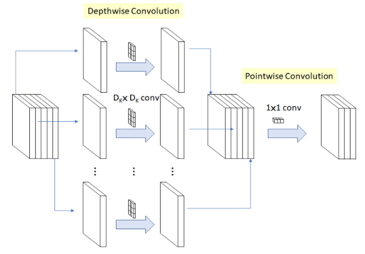
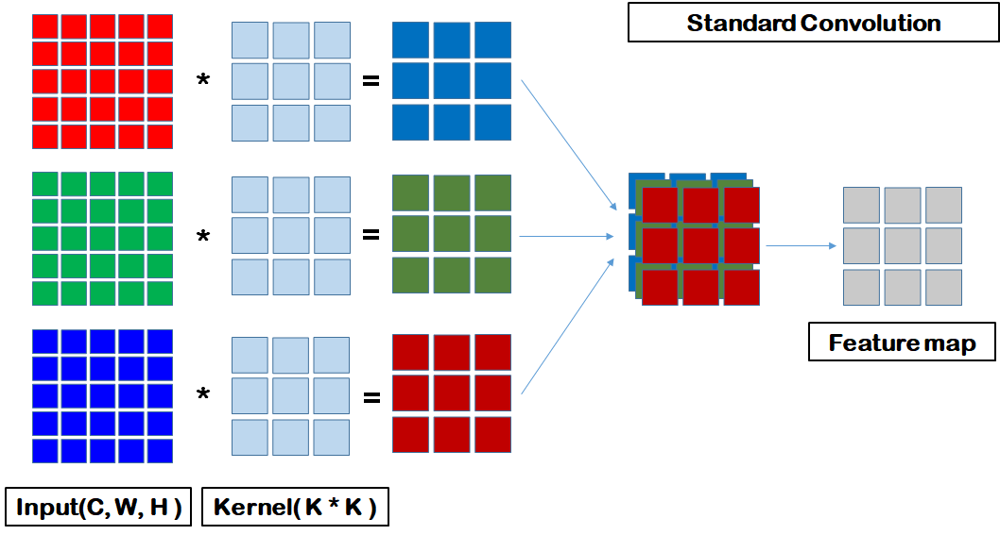
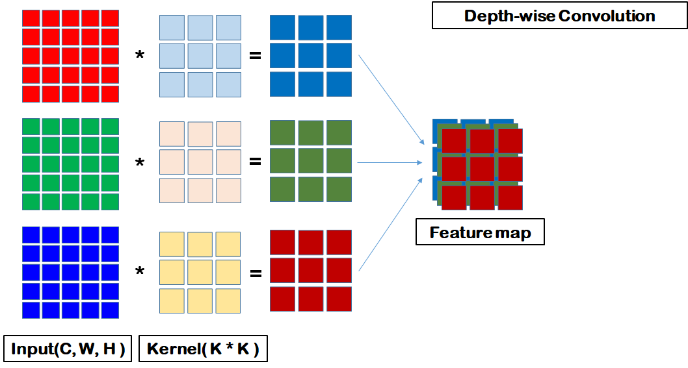

# MobileNet: Efficient Convolutional Neural Networks for Mobile Vision Application

MobileNet은 Google에서 개발한 컴퓨터 비전을 위한 경량화된 딥 러닝 모델 아키텍처입니다.
이 모델은 효율성과 성능 사이의 균형을 맞추기 위해 설계되었으며, 특히 모바일 및 임베디드 비전 애플리케이션에 적합합니다.

핸드폰이나 임베디드 시스템 같이 저용량 메모리 환경에 딥러닝을 적용하기 위해 모델 경량화가 필요하기 때문에 경량화에 집중하였고, 메모리가 제한된 환경에서 MobileNet을 최적으로 맞추기 위해 latency와 accuracy라는 파라미터의 균형을 조절합니다.

## 주요 기술

MobileNet은 Depthwise Seperable Convolution을 사용합니다. 이는 두 가지 주요 기술, 즉 **깊이별 컨볼루션(depthwise convolution)**과 **점별 컨볼루션(pointwise convolution)**을 사용하여 모델의 크기와 계산량을 줄입니다.
Xception은 깊이별 분산 컨볼루션(Depthwise Seprable Convolution)을 활용하여 감소한 파라미터 수 만큼 층을 쌓아 성능을 높이는데 집중하였습니다. 반대로 MobileNet은 이를 활용하여 경량화에 집중하였습니다.
이러한 모델이 더 적은 리소스를 사용하면서도 높은 정확도를 유지할 수 있게 해줍니다.

경량화 방법과 그 구조를 이해하기 위해 Depthwise Separable Convolution에 대한 개념이 필요합니다.

### 1. Depthwise Seperable Convolution

#### 1. 깊이별 컨볼루션(Depth-wise Convolution)

Depthwise convolution은 각 입력 채널에 대하여 3 \* 3 conv 하나의 필터가 연산을 수행하여 하나의 피쳐맵을 생성합니다. 입력 채널 수가 M개이면 M개의 피쳐맵을 생성하는 것입니다. 각 채널마다 독립적으로 연산을 수행하여 spatial correlation을 계산하는 역할을 합니다.

1. Standard Convolution
   

2. Depth-wise Convolution
   

일반 Standard Convolution(SC)과의 차이즘은 SC는 입력데이터의 채널별로 특징들을 뽑아서 하나의 Feature map을 만들어 냅니다. 하지만 Depth-wise Convolution은 한번 통과하고 나면, 하나로 병합되지 않고 각 채널별로 각각 Feature Map이 됩니다.

3 \* Feature Map = Kernal Size \* Kernel Sizee \* 3

정리하자면 깊이별 컨볼루션에서는 각 입력 채널에 대해 독립적으로 컨볼루션 필터를 적용합니다. 이렇게 하면 각 채널에서의 피처를 독립적으로 합습할 수 있으며, 계산 비용을 크게 줄일 수 있습니다.
하지만 그렇게 되면 채널 간의 상호작용을 고려하지 못하기에 이후 1\*1 컨볼루션 (Pointwise Convolution)을 사용하여 각 채널의 출력을 결합합니다.

따라서 깊이별 컨볼루션은 계산 효율성을 크게 향상시키면서도, 각 채널에서의 피처를 독립적으로 합습할 수 있는 방법을 제공합니다. 이는 특히 모바일 기기와 같은 자원이 제한된 환경에서 중요합니다.

#### 2. 1\*1 점별 컨볼루션(PointWise convolution)

> Seperable Convolution(깊이별 컨볼루션, SC)과 Pointwise Convolution(1\*1 컨볼루션, PW)개념이 Depthwise Seperable Convolution을 다룬 블로그별로 다르게 명시하는데 Seperable Convolution은 Pointwise Convolution을 포함하는 더 큰 개념입니다.

이전 Depth-Wise Convolution에서는 공간방향의 convolution을 진행한 후, channel 방향의 convolution을 진행하는가/진행하지 않는가로 나뉘었던 결과물이었습니다.

이와 비슷하지만 Poinwise Convolution(PC)은 공간방향의 convolution은 진행하지 않고, 채널 방향의 convolution을 진행하는 것입니다.

PW는 1\*1 크기의 커널을 사용하는 컨볼루션입니다. 이것은 기본적으로 각 위치에서 모든 입력 채널을 통해 정보를 결합하는 역할을 합니다. 이는 채널 간의 상호작용을 가능하게 하며, 네트워크의 표현력을 높이는 데 도움이 됩니다.

> [1\*1 Convolution의 역할을 자세하게 알고 싶다면 이 글을 참고하세요](https://coding-yoon.tistory.com/116)

[1\*1 Convolution](./img/point_conv.png)

PW는 두가지 특성을 가지고 있습니다.

1. **공간적인 특성**을 가지고 있지 않다
2. 연산량이 가장 적게 필요로 하기 때문에, **Feature Map 개수를 조절**할 때 사용된다.

## Architecture

[MobileNet Architecture](./img/MN-Archi.png)

첫 번째 conv를 제외하고 depthwise separable convolution을 사용합니다. 마지막 FC 레이어를 제외하고 모든 레이어에 BN, ReLU를 사용합니다. Down-sampling은 depthwise convolution과 첫 번째 conv layer에서 수행합니다. 총 28 레이어를 갖습니다.

## 버전(발전 방향)

### MobileNetV1

MobileNet의 첫 번째 버전인 MobileNetV1은 2017년에 소개되었습니다. 이 모델은 기존의 컨볼루션 신경망(CNN)모델들에 비해 훨씬 적은 파라미터를 사용하면서도 비슷한 성능을 보여주었습니다.

### MobileNetV2

MobileNetV2는 2018년에 발표되었으며, 이 모델은 이전 버전에 비해서 성능을 향상 시키기 위해 잔차 연결(residual connection)과 선형 병목(linear bottleneck)을 도입했습니다. 이러한 기술은 모델의 효율성을 높이고, 정보의 손실을 최소화하는 데 도움이 되었습니다.

#### 잔차 연결(residual connection)

#### 선형 병목(linear bottleneck)

### MobileNetV3

MobileNetV3는 2019년에 발표되었으며, 이 모델은 자동화된 검색 알고리즘을 사용하여 아키텍처를 최적화했습니다. 이 알고리즘은 모델의 성능을 더욱 향상시키는 데 도움이 되었습니다.

## 인용

[Mobile-Former: Bridging MobileNet and Transformer](https://arxiv.org/abs/2108.05895) 이 논문에서는 MobileNet과 Transformer 사이의 두 가지 방향의 다리를 설계합니다. 이 구조는 MobileNet의 로컬 처리와 Transformer의 글로벌 상호작용의 장점을 활용합니다.

[A Novel Image Classification Approach via Dense-MobileNet Models](https://www.hindawi.com/journals/misy/2020/7602384/) 이 논문에서는 Dense-MobileNet 모델을 통한 새로운 이미지 분류 방법을 제안합니다. 이 방법은 네트워크의 매개변수 수를 더욱 줄이고 분류 정확도를 향상시킵니다.

## 참고자료

1. [[논문 읽기] MobileNet(2017) 리뷰, Efficient Convolutional Neural Networks for Mobile Vision](https://deep-learning-study.tistory.com/532)
2. [[딥러닝] Depth-wise Separable Convolution 원리(Pytorch 구현)](https://coding-yoon.tistory.com/122)
3. [CONV2D - PyTorch](https://pytorch.org/docs/stable/generated/torch.nn.Conv2d.html?highlight=conv2d#torch.nn.Conv2d)
4. [depthwise convolution / pointwise convolution](https://blog.naver.com/PostView.nhn?blogId=worb1605&logNo=221386398035&categoryNo=27&parentCategoryNo=0&viewDate=&currentPage=1&postListTopCurrentPage=1&from=search)
