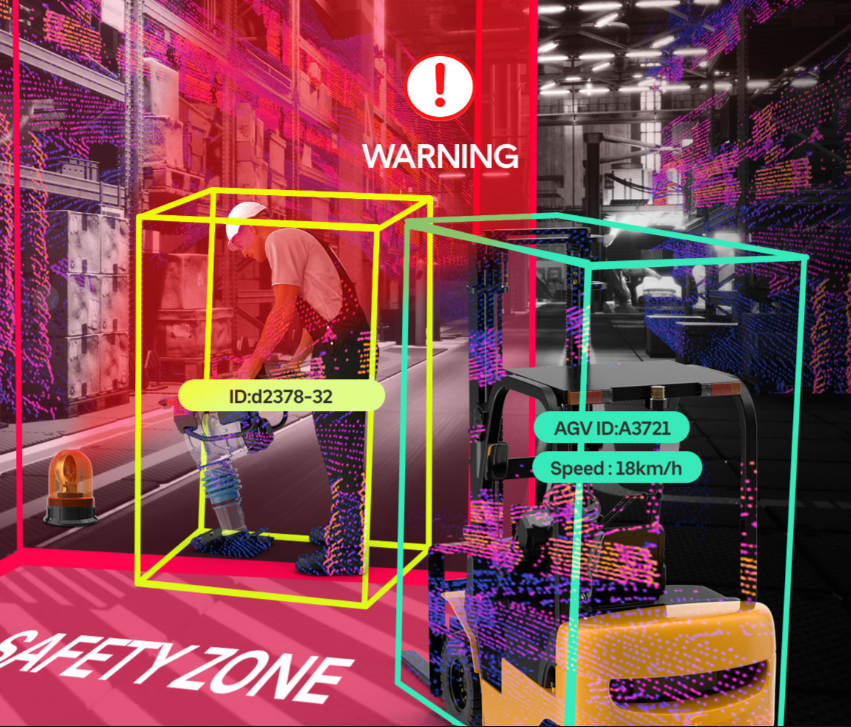
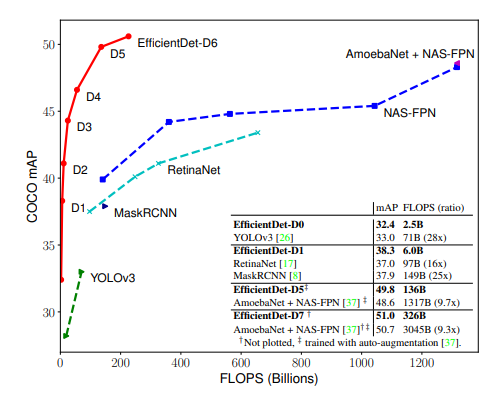
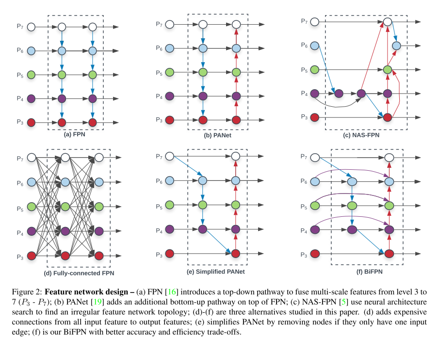
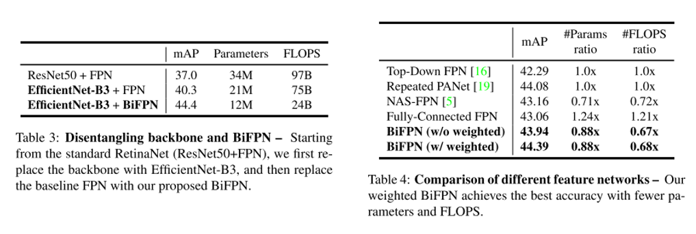
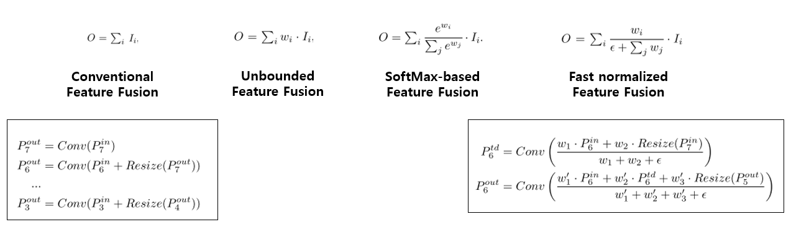
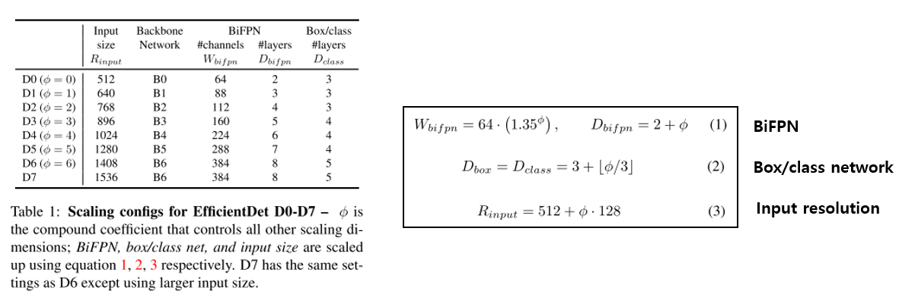
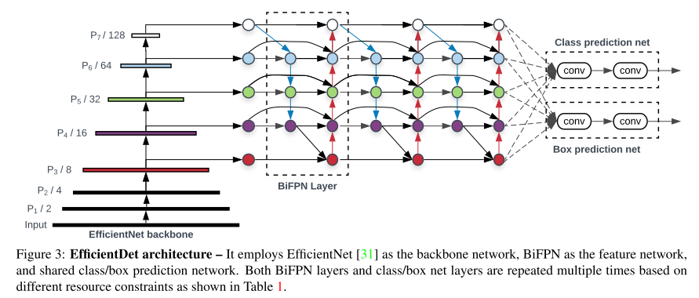
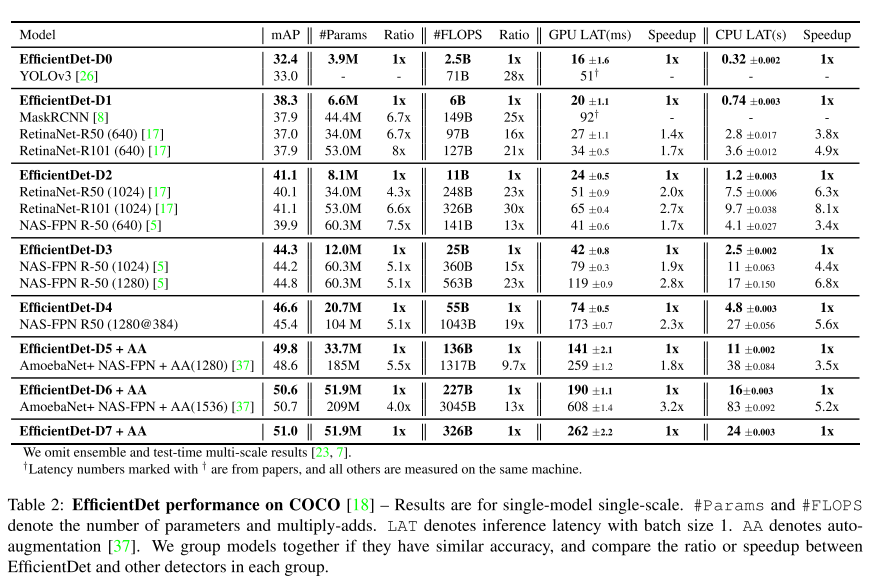
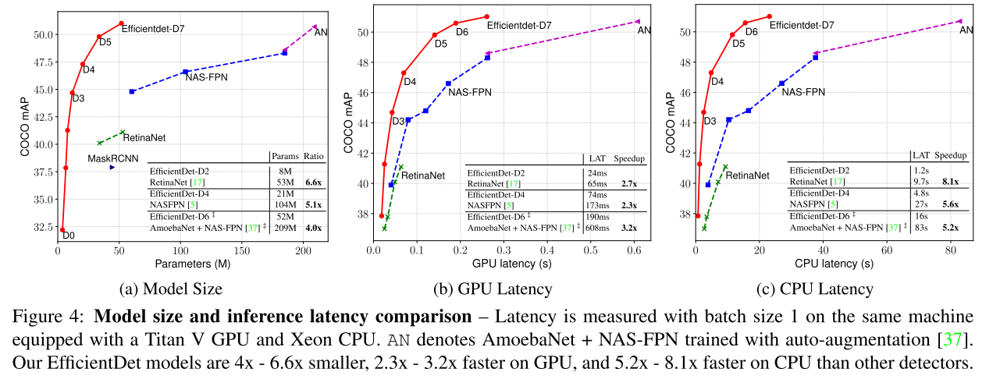

# EfficientDet (Scalable and Efficient Object Detection)(2019)

EfficientDet은 Google Brain팀에서 쓴 논문이며, 객체 탐지(Object Detection)를 타겟으로 한 모델입니다. 컴퓨터 비전에서 모델 효율성이 점점 중요해지고 있습니다. 이 모델은 객체 탐지를 위한 신경망 구조 설계에 대해 체계적으로 연구하고, 효율성을 향상시키기 위한 몇 가지 핵심 최적화를 제안합니다.

## 활용 분야

EfficientDet은 다양한 객체 탐지 작업에 활용될 수 있습니다. 이 모델은 높은 성능과 효율성을 동시에 달성하기 때문에, 다양한 환경에서 사용될 수 있습니다. 다음은 몇 가지 주요 활용 분야입니다:

1. 자율주행: 자율주행 자동차는 주변 환경을 이해하고 안전하게 운전하기 위해 객체 탐지 기술을 필요로 합니다. EfficientDet는 차량, 보행자, 자전거 등의 객체를 빠르고 정확하게 탐지할 수 있습니다.

2. 보안 및 감시: 보안 카메라와 드론은 사람, 차량, 동물 등의 움직임을 탐지하고 추적하는 데 객체 탐지 기술을 사용합니다. EfficientDet는 실시간으로 높은 정확도로 객체를 탐지할 수 있기 때문에, 이러한 시스템에서 널리 사용될 수 있습니다.

3. 의료 이미징: 객체 탐지 기술은 의료 이미지 분석에서도 중요한 역할을 합니다. 예를 들어, EfficientDet는 MRI나 CT 스캔에서 병변이나 종양을 탐지하는 데 사용될 수 있습니다.

4. 공간 인식: 위성 이미지 분석에서, EfficientDet는 건물, 도로, 농지 등의 객체를 탐지하는 데 사용될 수 있습니다. 이는 도시 계획, 재난 관리, 환경 모니터링 등의 분야에서 중요한 역할을 합니다.

## 연구 배경

EfficientDet의 연구 배경은 객체 탐지 모델의 효율성과 성능을 동시에 향상시키는 데 있습니다. 그러나 객체 탐지 모델은 종종 많은 계산 리소스를 필요로 하며, 이는 모바일 기기나 에지 장치와 같은 자원이 제한된 환경에서는 문제가 될 수 있습니다. 또한, 이러한 모델은 종종 복잡한 아키텍처를 가지고 있어, 훈련과 추론이 어렵고 시간이 많이 걸릴 수 있습니다.

EfficientDet의 연구자들은 이러한 문제를 해결하기 위해, **효율적인 네트워크 구조**를 사용하고, 복합 스케일링 방법을 적용하고, 자동 모델 탐색을 통해 최적의 모델을 찾는 방법을 제안했습니다. 이러한 접근법은 모델의 성능을 향상시키면서도, 계산 비용을 크게 줄일 수 있습니다. 이로 인해 EfficientDet는 다양한 환경에서 높은 성능의 객체 탐지를 가능하게 합니다.

당시 Object Detection을 주제로 한 논문이 굉장히 많이 나왔습니다. AutoML을 이용하여 찾은 Feature Pyramid Network 구조와, AutoML로 찾은 굉장히 큰 Backbone Architecture인 AmoebaNet을 섞어서 사용한 것이 COCO 데이터셋에서 가장 좋은 성능을 보이고 있습니다.

그런상황에서도 EfficientDet은 기존 모델들의 성능을 크게 상회하는, 특히 연산량, 연산 속도 관점에서는 굉장히 효율적인 모델을 제안 했습니다.

## Main Challenge

Speed와 Accuracy는 Trade-Off 관계를 가지기 때문에 높은 정확도와 좋은 효율을 동시에 잡기 괸장히 어렵습니다. 그런 상황에서 이 논문은 Object Detection 분야에서 고려해야 할 요소를 크게 2가지로 삼았습니다.

#### Challenge 1. Efficient multi-scale feature fusion

EfficientDet의 연구에서는 효율적인 다중 스케일 피처 융합에 대한 도전을 제기하였습니다. Feature Pyramid Neetwork(FPN)은 2017년에 공개된 이후로 대부분의 객체 탐지 연구에서 사용되고 있습니다. One-Stage Detector의 대표적인 모델인 RetinaNet, M2Det, 그리고 FPN 구조에 AutoML의 Neural Architecture Search를 적용한 NAS-FPN 등이 FPN을 적용하고 성능을 개선하려는 연구들이 많이 진행되었습니다.

하지만 선행 연구들은 모두 서로 다른 input feature들을 합칠 때 구분없이 단순히 더하는 방식을 사용하고 있음을 지적하였습니다. 서로 다른 input feature들의 중요성을 학습을 통해 배울 수 있는 가중치가 부여된 양방향 **FPN(BiFPN)** 구조가 제안되었습니다. 이 구조를 사용하면 성능을 크게 향상시킬 수 있었습니다.

#### Challenge 2. Model scaling

EfficientDet의 연구에서는 모델 스케일링에 대한 도전을 제기하였습니다.

EfficientNet에서 제안한 **Compound Scaling** 기법은 모델의 크기와 연산량을 결정하는 요소들(input resolution, depth, width)을 동시에 고려하여 증가시키는 방법을 의미합니다. 이 방법을 통해 높은 성능을 달성할 수 있었습니다.

이러한 아이디어를 객체 탐지에도 적용할 수 있습니다. 이를 위해, backbone, feature network, box/class prediction network 등 모든 곳에 Compound Scaling 기법을 적용하였습니다.(EfficientNet에서는 Image Classification 문제를 타겟으로 논문을 작성했습니다.)

## 주요 기술

### BiFPN

Feature Pyramid Network를 이용한 방법들을 모아둔 그림은 다음과 같습니다.

(a) 방식이 전통적인 FPN 구조를 의미하고, (b) PANet은 추가로 bottom-up pathway를 FPN에 추가하는 방법을 제안하였습니다.

(c)는 AutoML의 Neural Architecture Search를 FPN 구조에 적용하였고, 불규칙적인 FPN 구조를 보이는 것이 특징입니다. 또한 (a)와 (b) 구조는 같은 scale에서만 connection이 존재하지만, (c) 구조부터는 scale이 다른 경우에도 connection이 존재하는 Cross-Scale Connection 을 적용하고 있습니다.

(d)와 (e)는 본 논문에서 추가로 제안하고 실험을 한 방식이고, 마지막 (f) 방식이 본 논문에서 제안하고 있는 BiFPN 구조를 의미합니다.

(f) 그림의 보라색 선처럼 같은 scale에서 edge를 추가하여 더 많은 feature들이 fusion되도록 구성을 한 방식이 BiFPN입니다. 또한 PANet은 top-down과 bottom-up path를 하나만 사용한 반면, 본 논문에서는 이러한 구조를 여러 번 반복하여 사용을 하였습니다. 이를 통해 더 high-level한 feature fusion을 할 수 있음을 주장하고 있습니다.

BiFPN의 성능 향상을 살펴보기 위해 2가지 ablation study를 하였습니다. Table 3에서 저자는 같은 backbone인 EfficientNet-B3에서 FPN을 BiFPN으로 바꿨을 때의 성능을 측정하였고, mAP는 약 4.1 증가하였고 parameter 수와 FLOPS도 적게 사용하고 있음을 보여주고 있습니다. Table 4에서는 위에서 보여드렸던 여러 Feature Network 방식들에 따라 성능이 어떻게 바뀌는지를 분석한 결과이며 BiFPN을 사용하였을 때 가장 좋은 성능을 보임을 확인할 수 있습니다.

### Compound Scaling

FPN에서 서로 다른 resolution의 input feature들을 합칠 때, 일반적으로는 같은 해상도가 되도록 resize를 시킨 뒤 합치는 방식을 사용합니다. 하지만 앞에서 말씀드렸듯이 모든 input feature들을 동등하게 처리를 하고 있는 점을 문제점으로 인식하고, 본 논문에서는 이 점을 개선하기 위해 각 input feature에 가중치를 주고, 학습을 통해 가중치를 배울 수 있는 방식을 제안하였습니다. 총 3가지 방식을 제안하고 있으며 각 방식을 하나의 그림으로 정리하면 다음과 같습니다.

우선 weight는 scalar (per-feature)로 줄 수 있고, vector (per-channel)로 줄 수 있고 multi-dimensional tensor (per-pixel)로 줄 수 있는데, 본 논문에서는 scalar를 사용하는 것이 정확도와 연산량 측면에서 효율적임을 실험을 통해 밝혔고, scalar weight를 사용하였습니다.

Unbounded fusion은 말 그대로 unbounded 되어있기 때문에 학습에 불안정성을 유발할 수 있습니다. 그래서 weight normalization을 사용하였다고 합니다.

SoftMax-based fusion은 저희가 익히 알고 있는 SoftMax를 사용한 것이지만, 이는 GPU 하드웨어에서 slowdown을 유발함을 실험을 통해 보여주고 있습니다.

그래서 본 논문은 Fast normalized fusion 방식을 제안하였습니다. 우선 weight들은 ReLU를 거치기 때문에 non-zero임이 보장이 되고, 분모가 0이 되는 것을 막기 위해 0.0001 크기의 입실론을 넣어주었습니다. Weight 값이 0~1사이로 normalize가 되는 것은 SoftMax와 유사하며 ablation study를 통해 SoftMax-based fusion 방식보다 좋은 성능을 보임을 보여주고 있습니다.

Backbone network에는 EfficientNet-B0 부터 B6까지 사용을 하였으며 마찬가지로 ImageNet-pretrained network를 가져와서 사용을 하였습니다. 실험에 사용한 Compound Scaling configuration은 아래 그림에서 확인하실 수 있습니다.

EfficientNet에서 사용된 Compound Scaling처럼 input의 resolution과 backbone network의 크기를 늘려주었고, BiFPN과 Box/class network 도 동시에 키워주는 것을 확인하실 수 있습니다. 각 network마다 어떻게 키워줬는지는 위의 그림의 (1) ~ (3)에서 확인하실 수 있습니다.

### EfficientDet Architecture

EfficientDet의 backbone으로는 ImageNet-pretrained EfficientNet을 사용하였습니다. BiFPN을 Feature Network로 사용하였고, level 3-7 feature에 적용을 하였습니다. 또한 top-down, bottom-up bidirectional feature fusion을 반복적으로 사용하였습니다.

## 실험 결과

COCO 데이터셋에서 가장 높은 mAP를 달성하여, 2019년 11월 기준 State-of-the-art(SOTA) 성능을 보이고 있으며, 기존 방식들 대비 연산 효율이 압도적으로 좋음을 확인할 수 있습니다.

모델의 크기, 즉 parameter 수와, Inference Latency를 GPU와 CPU에서 측정한 실험 결과도 이 논문의 위력을 잘 보여주고 있습니다. 단순히 FLOPS가 적다고 해서 항상 Inference Latency가 적다는 보장이 없기 때문에 실제 Inference Latency를 보여주고 있고, 이러한 결과는 참 유용한 것 같습니다. 그림을 보시면 아시겠지만 정확도도 높고, 모델 크기도 작고, Latency도 낮아서 빠르게 동작할 수 있음을 보여주고 있습니다. 논문에서는 정확히 어떤 셋팅에서 학습을 시켰는지에 대한 자세한 내용도 확인하실 수 있습니다.

## 관련 연구

## 참고자료

1. [EfficientDet ： Scalable and Efficient Object Detection Review](https://hoya012.github.io/blog/EfficientDet-Review/)

2. [EfficientNet: Rethinking Model Scaling for Convolutional Neural Networks](https://cocopambag.tistory.com/43)
