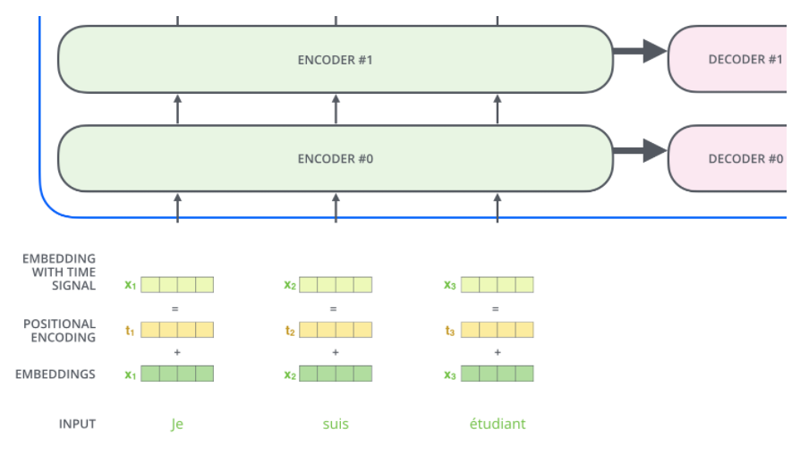
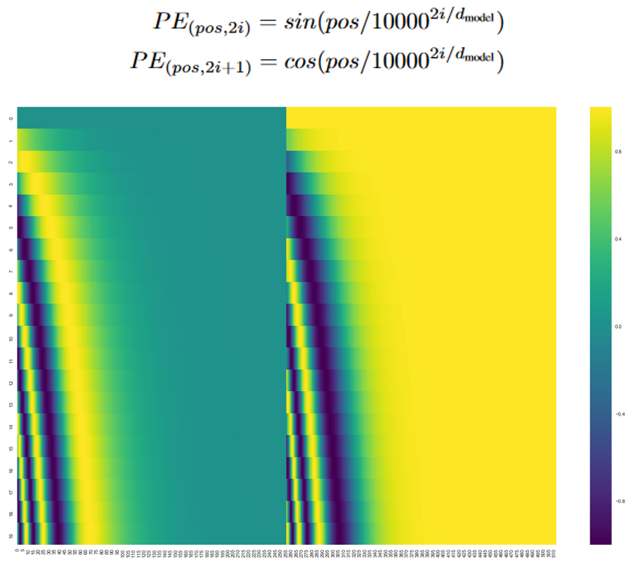
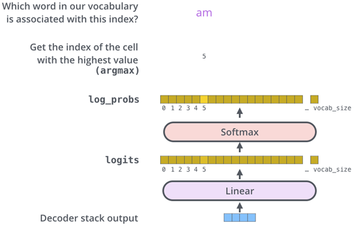
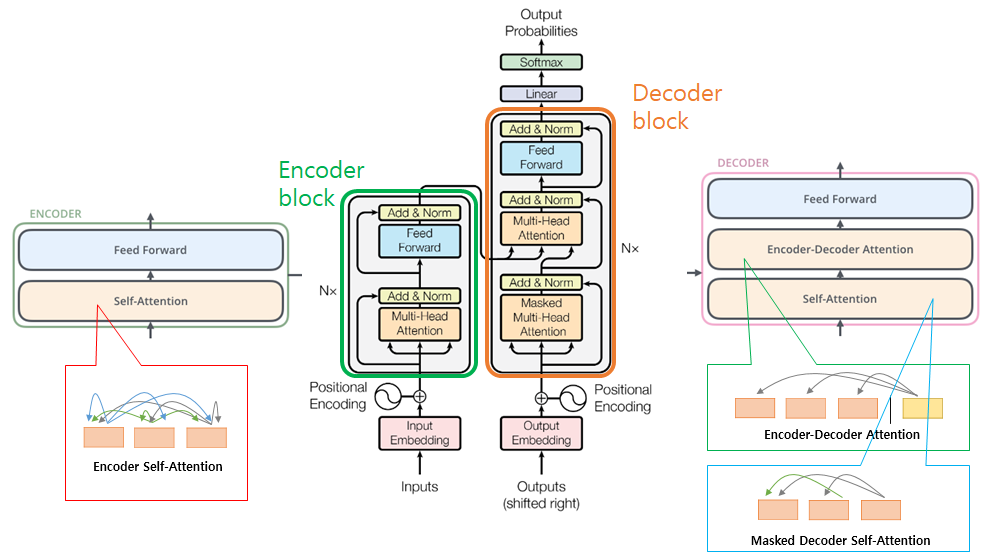
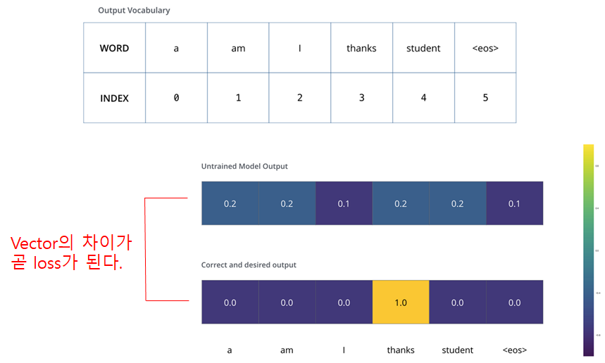
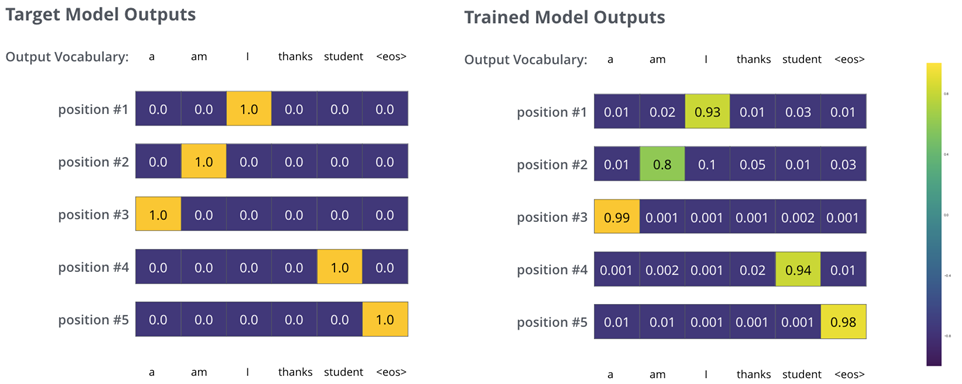
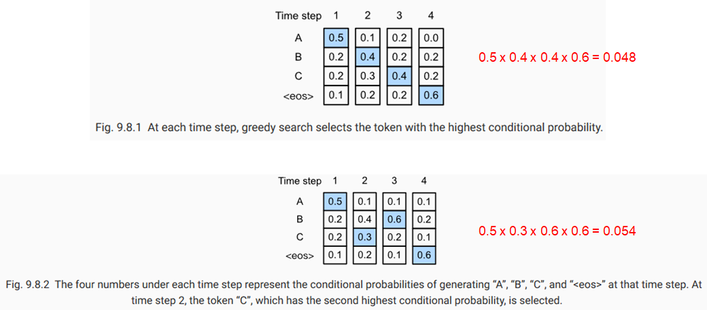
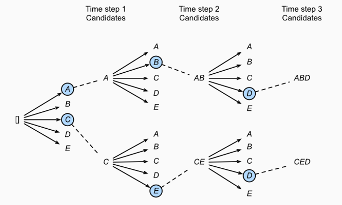
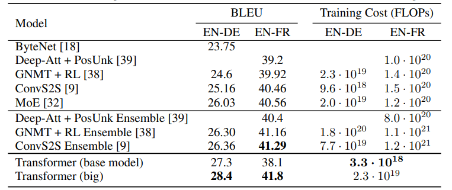
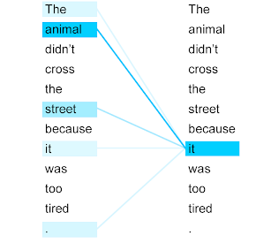

# 간단한 소개

본 연구에서는 인코더-디코더 구조를 기반으로 한 시퀀스 변환 모델인 Transformer를 제안합니다. 이 모델은 전통적인 순환 및 합성곱 계층을 대체하여, 다중 헤드 셀프-어텐션(자기 주의)를 사용합니다. Transformer는 더욱 빠르게 학습되며, WMT 2014 영어-독일어 및 영어-프랑스어 번역 작업에서 최첨단 성능을 달성하였습니다. 또한, 구문 구조분석 및 반지도 학습에서도 높은 성능을 보여주어 이 모델이 다양한 작업에 적용될 수 있음을 확인할 수 있습니다. 이 프로젝트는 향후 모델 확장성과 다른 입력 및 출력 데이터 타입의 적용에 관심을 가지고 진행될 예정입니다.

우선 Transformer는, 쉽고 간단히 말해서, 그냥 번역기입니다. A언어로 쓰인 어떤 문장이 Transformer로 입력되면, 여러 개의 인코더 블록과 디코더 블록(논문에서는 각각 6개)을 통과하여 B언어로 쓰인 것 같은 의미의 문장으로 출력되는 것입니다.

인코더 블록과 디코더 블록의 구조는 각각 입력된 문장내 단어간의 관계를 보여주는 self-attention layer와 모든 단어들에 동일하게 적용되는 fully connected feed-foward layer로 구성되어 있으며, 디코더 블록에는 이에 더해 encoder-decorder attention layer가 두 layer 사이에 들어가 있다.

# 모델

## Input - Word2Vec

각 블록별 내부 구조를 하나하나 뜯어보기 전에, 잠시 입력에 대해 짚고 넘어가겠습니다. 우리가 transformer에 어떤 문장을 입력할 때, 가장 먼저 거치는 과정은 그 문장을 모델이 연산할 수 있는 숫자형태로 바꿔주는 것입니다. 다시말해 각 문장을 의미를 갖는 최소 단위인 단어들로 쪼갠 다음, Word2Vec이라는 알고리즘을 통해 각 단어를 vector형태로 변환합니다. 우리가 image classification이나 detection 등을 할 때 이미지에서 feature를 추출하듯, 이 과정을 통해 단어는 그 의미를 보존한채 low-dimensional vector로 변한다. 이러한 일련의 과정을 word embedding이라고 합니다.

Encoder Block

## 1. Self-Attention

문장은 word embedding을 거쳐 크기가 512인 vector들의 list{X1,X2,...Xn}로 바뀐채 먼저 첫번째 인코더 블록의 attention layer로 입력된다. 그리고 (우리가 학습시켜야할) Weight W를 만나 벡터곱을 통해 Query, Key, Value라는 3가지 종류의 새로운 벡터를 만들어낸다. 각 단어의 3가지 vector에 대해 다른 모든 단어들의 key vector와 특정한 연산을 하여 attention layer의 출력을 만들어낸다. 아래에서 그 과정을 좀더 들여다볼 예정인데, 만약 복잡한 연산과정을 알고 싶지 않다면 self-attention layer는 각 단어의 vector들끼리 서로간의 관계가 얼마나 중요한지 점수화한다 는 개념만 알고 넘어가도 좋습니다.

Query vector는 문장의 다른 단어들의 Key vector들과 곱합니다. 이렇게 함으로써 각 단어가 서로에게 얼마나 중요한지 파악할 수 있습니다. 이때 주의할 점은 자기자신의 key vector와도(Self-Attention) 내적한다는 것입니다. 이렇게 얻어진 각 값들은 계산의 편의를 위해 key vector 크기의 제곱근으로 나눠진 뒤, softmax를 적용해 합이 1이 되도록 합니다. 거기에 각 단어의 value vector를 곱한 뒤 모두 더하면 우리가 원하는 self-attention layer의 출력이 나옵니다.

이 출력은 입력된 단어의 의미뿐만 아니라, 문장내 다른 단어와의 관계 또한 포함하고 있습니다. 예를 들어 '나는 사과를 먹으려다가 그것이 썩은 부분이 있는 것을 보고 내려놓았다.' 라는 문장을 살펴보면, 우리는 직관적으로 '그것'이 '사과'임을 알 수 있지만, 여태까지의 NLP 알고리즘들은 문맥을 읽기 어렵거나 읽을 수 있다해도 단어와 단어사이의 거리가 짧을 때만 이해할 수 있었습니다. 그러나 attention은 각 단어들의 query와 key vector 연산을 통해 관계를 유추하기에 문장내 단어간 거리가 멀든 가깝든 문제가 되지 않습니다.

논문에서는 이러한 self-attention 구조가 왜 훌륭한지에 대해서도 한 장을 활용하여 언급합니다. 우선 연산 구조상 시간복잡도가 낮고 병렬화가 쉬워 컴퓨팅 자원소모에 대한 부담이 적다는 점이 있습니다. 또한 거리가 먼 단어간의 관계도 계산하기 쉽고 연산과정을 시각화하여 모델이 문장을 어떻게 해석하고 있는지 좀더 정확히 파악할 수 있다는 점에서도 유리하다고 합니다.

## 2. Multi-Head Attention

모두가 알다시피 백지장도 맞들면 낫고, 회초리는 여러 개 묶을 경우 부러뜨리기 어렵습니다. 논문의 저자도 비슷한 생각을 하지 않을까 생각합니다. Attention이 문맥의 의미를 잘 파악하는 알고리즘이긴 하지만, 단독으로 쓸 경우 자기자신의 의미에만 지나치게 집중할 수 있기에 논문의 저자는 8개의 attention layer를 두고 각각 다른 초기값으로 학습을 진행하였습니다. 각 layer에서 나온 출력은 그대로 합한 뒤 또다른 weight vecotr를 곱해 하나의 vector로 취합하며, 이것이 multi-head attention layer의 최종 출력이 됩니다.

이 방식의 장점은 8개의 서로 다른 representation subspace를 가짐으로써 single-head attention보다 문맥을 더 잘 이해할 수 있게 된다는 것입니다. 위에서 예시를 들었던 '나는 사과를 먹으려다가 그것이 썩은 부분이 있는 것을 보고 내려놓았다.' 문장을 다시 봅시다. 그것과 사과는 같은 것을 가르키는 것이 맞지만, 또한 동시에 '썩은 부분'과도 관련이 있으며 '내려놓았다'와도 관련이 있습니다. single-head attention의 경우 이 중 하나의 단어와의 연관성만을 중시할 가능성이 높지만, multi-head attention은 layer를 여러 번 조금 다른 초기 조건으로 학습시킴으로써 '그것'에 관련된 **단어에 대해 더 많은 후보군을 제공**합니다.

## 3. Position-Wise Feed-Forward Networks

attention layer를 통과한 값들은 fully connected feed-foward network를 지나가게 됩니다. 이때 하나의 인코더 블록 내에서는 다른 문장 혹은 다른 단어들마다 정확하게 동일하게 사용되지만, 인코더 마다는 다른 값을 가지게 됩니다. 이 과정의 필요성은 논문에서 특별히 언급하지는 않았지만 학습편의성을 위한 것으로 추정됩니다.

## Positional Encoding

우리는 위에서 단어가 인코더 블록에 들어가기 전에 embedding vector로 변환됨을 보았습니다. 사실 여기에 한가지가 더 더해진채 인코더 블록에 입력되는데, 그것은 바로 positional encoding입니다. 여태까지 과정을 잘 복기해보면 단어의 위치정보, 즉 단어들의 순서는 어떤지에 대한 정보가 연산과정 어디에도 포함되지 않았음을 알 수 있습니다. 문장의 뜻을 이해함에 있어 단어의 순서는 중요한 정보이므로 Transformer 모델은 이를 포함하고자 하였습니다.

Positional encoding vector를 하기 위한 함수는 여러 가지가 있지만 이 논문에서는 sin함수와 cos함수의 합으로 표현(그림x 상단)하였습니다. 그 이유는 함수의 특성상 특정 위치에 대한 positional vector는 다른 위치에 대한 positional vector의 합으로 표현할 수 있기 때문에 모델이 학습당시 보지 못한 길이의 긴 문장을 만나도 대응할 수 있게 되기 때문입니다.

## Decoder Block

그림3에서 알 수 있듯이, 인코더 블록과 디코더 블록은 비슷하지만 약간 다른 구조를 가지고 있습니다.

먼저 self-attention시 현재 위치의 이전 위치에 대해서만 attention할 수 있도록 이후 위치에 대해서는 -∞로 마스킹을 했다. 또한 이렇게 통과된 vector중 query만 가져오고, key와 value vector는 인코더 블록의 출력을 가져온다.

인코더와 마찬가지로 6개의 블록을 통과하면 그 출력은 FCN(Fully Connected Network)과 Softmax를 거쳐 학습된 단어 데이터베이스 중 가장 관계가 깊어보이는 단어를 출력하게 됩니다.

# 모델 정리(Model Summary)

# 훈련(Train)

이제 구체적인 학습과정을 알아보겠습니다. 우선 loss function을 이해하기 위해서 단순한 예를 들어, 프랑스 단어 'merci'(감사하다)를 영어로 번역하는 상황을 가정해보겠습니다. 그리고 학습 단계전에 미리 데이터 전처리를 통해 만들 수 있는 단어 데이터베이스에는 <a, am, I, thanks, students, <eos>> 6가지 단어가 있다고 가정합니다.

처음에는 전혀 학습이 되지 않을 상태이기에 모든 단어에 대해 비슷한 확률값이 나올 것입니다. 그 출력과 정답 vector의 차이를 backpropergation하여 학습이 진행되면, 점점 merci 입력에 대해 thanks 출력이 나올 확률이 높아지게 됩니다.

이제 조금 더 복잡한 예시로 프랑스어 문장 "je suis étudiant" (나는 학생이다)에 대한 학습 과정을 보겠습니다.

target vector가 단어들의 list로 바뀌었을 뿐, 같은 과정을 거칩니다.

그런데 다음 단어를 예측할 때, 그자리에 올 단어 중 무조건 가장 높은 확률을 가진 단어만을 골라나가는 것이 올바른 예측방법일까? 가령, 산을 오른다고 가정했을 때, 매순간 무조건 가장 경사가 급한 방향으로만 가는 것이 가장 빨리 정상에 도달하는 방법일까?

물론 그렇지 않습니다. 당장 눈앞에 경사가 급한 방향으로 간다해도 사실 그 방향은 멀리 보면 골짜기로 이어져 있을 수도 있는 것입니다. 비슷한 원리로 Transformer에서도 정답 문장을 예측할 때 각 위치별로 n개의 확률이 높은 단어 후보들에 대해 m번째 timestep까지의 경우를 모두 계산하면서 정답을 찾아갑니다. 이러한 방식을 Beam search라고 하며, n(beam size)과 m(top beams)은 우리가 학습전에 미리 설정할 수 있는 hyperparameter입니다.

# 결과 (Result)

Transformer는 기존의 CNN, RNN 구조를 전혀 쓰지 않고도 등장하자마자 WMT 2014 English-to-German translation, WMT 2014 English-to-French translation 두 번역 부분에서 SOTA를 차지해서 NLP 연구자들에게 충격을 주었습니다.

## Visualization of an attention layer

# 결론

지금까지 Transformer에 대해 알아보았습니다. AlexNet이 2012년 ImageNet 영상분류 문제에서 압도적인 SOTA를 달성했을 때 사람들이 앞다투어 CNN을 파고들었습니다. Transformer는 정도의 차이는 있을지언정, 기존 문제에 대해 완전히 새로운 해결책으로 attention을 보급했다는 점에서 가히 AlexNet에 비견할만하다고 생각합니다. 현재 BERT, DETR, GPT-3 등 각 분야에서 Transformer를 베이스로 한 새로운 모델들이 쏟아져나오고 있으며 앞으로도 한동안은 그럴 것 같습니다.

# 참고자료

1. [Transformer는 이렇게 말했다, "Attention is all you need."](https://blog.promedius.ai/transformer/)
2. [Attention Is All You Need(transformer) paper 정리](https://omicro03.medium.com/attention-is-all-you-need-transformer-paper-%EC%A0%95%EB%A6%AC-83066192d9ab)
3. [Attention Is All You Need](https://arxiv.org/abs/1706.03762)
4. [Transformer Architecture: The Positional Encoding](https://kazemnejad.com/blog/transformer_architecture_positional_encoding/)
5. [The Illustrated Transformer](https://jalammar.github.io/illustrated-transformer/?ref=blog.promedius.ai)
6. [밑바닥부터 이해하는 어텐션 메커니즘](https://glee1228.tistory.com/3)
