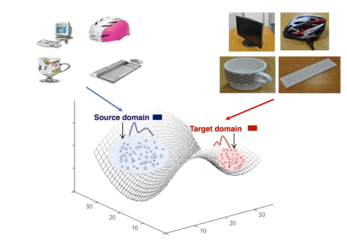
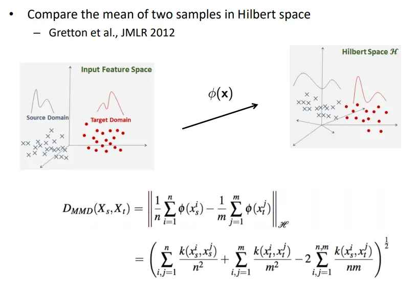

# Domain Adaptation

**도메인 적응(Domain Adaptation)**은 머신 러닝과 컴퓨터 비전, 자연어 처리 등 다양한 분야에서 사용되는 기술입니다. 이 기술의 주 목적은 하나의 도메인에서 학습된 모델을 다른 도메인에 적용할 수 있도록 하는 것입니다. 여기서 **'도메인'**이라는 용어는 특정한 특성이나 분포를 가진 데이터 집합을 의미합니다.

예를 들어, 어떤 이미지 분류 모델이 도로에서 차량을 분류하는 데 효과적이라고 가정해봅시다. 이 모델을 그대로 주차장의 차량 분류에 사용하려고 하면 성능이 떨어질 수 있습니다. 왜냐하면 도로와 주차장은 다른 환경적 특성과 조명, 배경 등을 가지고 있기 때문입니다. 도메인 적응은 이러한 문제를 해결하기 위해 도로에서 학습된 모델을 주차장 환경에 적응시키는 방법을 제공합니다.

도메인 적응은 주로 라벨이 있는 소스 도메인과 라벨이 없는 타겟 도메인 사이에서 이루어집니다. 이 기술은 소스 도메인에서 학습된 지식을 타겟 도메인에 전이하여, 타겟 도메인에서의 성능을 향상시키는 데 사용됩니다.

이러한 도메인 적응은 다양한 알고리즘과 방법론을 통해 이루어지며, 심층 학습(Deep Learning)을 활용한 심층 도메인 적응(Deep Domain Adaptation) 등도 연구되고 있습니다.

## Domain Adaptation의 문제 정의

Machine learning, Deep learning에서 항상 문제가 되는 것은 무엇일까요? 단순하게 말하면 학습 데이터에서는 잘 동작하는데 테스트 데이터에서는 잘 동작하지 않는 문제가 아마 가장 많을 것 같습니다. 원인은 학습 데이터가 다양하기 때문이기도 하고 model의 over-fitting 때문일 수도 있습니다. 또 하나 다른 이유는 학습 데이터와 테스트 데이터의 Domain-shift가 일어났기 때문입니다.

Domain Shift는 학습 데이터 (Source)와 테스트 데이터 (Target) 의 Distribution의 차이를 의미합니다. 예를 들면 같은 컵을 카메라로 찍었을 때와 캐리커쳐처럼 손으로 그렸을 때의 차이입니다. 물론 Shift가 작은 경우엔 고화질의 DSLR과 Webcam의 이미지도 Domain shift로 볼 수도 있겠습니다. 이 Domain shift가 심할수록 test data의 정확도는 떨어지게 됩니다.

* [출처 - [study] DA(Domain Adaptation)알아보기 기본편](https://lhw0772.medium.com/study-da-domain-adaptation-%EC%95%8C%EC%95%84%EB%B3%B4%EA%B8%B0-%EA%B8%B0%EB%B3%B8%ED%8E%B8-4af4ab63f871)

다른 Domain Adaptation의 예로는 Synthetic data를 이용해서 Real data를 대비하여 학습하는 경우입니다. 요즘 게임 그래픽이 굉장히 좋아지면서 해당 데이터를 학습함으로써 실제 영상에 적용했을 때도 성능 향상이 이루어지는 경우가 많습니다. 하지만 이 경우에도 같은 양의 Real data를 사용했을 때의 성능보다는 떨어질 수 있습니다.

## Traditional Domain Adaptation 방식

### 1. Metric Learning (Adapting Visual Category Models to New Domains , Metric Learning: Asymmetric Transformations )

메트릭 학습(Metric Learning)은 머신 러닝의 하위 분야로, 데이터 포인트 간의 유사성이나 거리를 측정하는 함수를 학습하는 것을 목표로 합니다. 이러한 유사성 측정은 추천 시스템, 이미지 검색, 얼굴 인식 등 다양한 응용 분야에서 중요한 역할을 합니다.

거리 기반으로 Domain adaptation을 진행합니다. 가장 기본적인 기본적인 생각으로 Source domain과 Target domain이 같은 클래스면 가깝게 만들고 다른 클래스면 멀게 만드는 것입니다. 직관적이며 확실한 방법이지만 이를 위해선 Source와 Target 모두 label이 필요합니다.

수식이 총 두가지 있는데 좌측의 수식은 Xs (Source domain)과 Xt(Target domain)의 거리를 구하는 공식입니다. 수식에서의 W는 X에서 Y로 가는 Transform function을 가정합니다. 우측의 수식은 source와 target의 label yi와 yj가 같은 경우에는 distance가 u보다 작도록 학습하고 (거리가 가깝도록 학습) 다른 경우에는 l보다 커지도록 학습합니다. (거리가 멀도록 학습). - 라벨이 같은 요소일 수록 거리가 가까워지게 하는 학습법이라고 생각하시면 편합니다.

* [Transform function](../../basic_concept/transform_function/README.md)

### 2. Subspace Representation

두 번째, Subspace Representation는 Source와 Target은 다른 [subspace](./../../basic_concept/subspace/README.md)에 놓여져 있고 이 둘의 subspace를 alignment하면 문제를 해결할 수 있다고 생각합니다. 따라서 Source subspace와 Target subspace 사이의 가능한 subspace를 sampling 혹은 Integration하여 Alignment하는 방식들이 있습니다.

### 3. Matching Distribution (MMD, Sample Reweighting / Selection, Transform Learning (TCA, DIP) , Hellinger Distance, SIE )

마지막으로, Matching Distribution은 Domain Shift로 인한 Distribution 차이를 직접적으로 해결하는데 초점을 맞춥니다.

위 그림은 Maximum Mean Discrepancy (MMD)를 설명하는 그림입니다. MMD는 두 개의 Distribution의 불일치성을 표현하는 수식으로써 Source와 Target을 Hilbert space로 mapping한 다음 distribution 차이를 계산합니다. 이 계산을 위해서는 두 번째 식과 같이 Xs와 Xt 각각 Intra-class간의 distribution의 차이는 적어야 하고 Inter-class간의 distribution의 차이는 커야 한다 (-가 곱해진 형태)

 , Sample Resampling (Right).webp)

### 참고자료
[[study] DA(Domain Adaptation)알아보기 기본편](https://lhw0772.medium.com/study-da-domain-adaptation-%EC%95%8C%EC%95%84%EB%B3%B4%EA%B8%B0-%EA%B8%B0%EB%B3%B8%ED%8E%B8-4af4ab63f871)