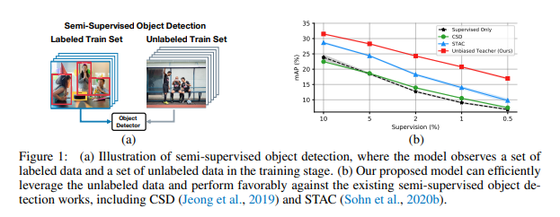

이 문서는 "Unbiased Teacher for Semi-Supervised Object Detection"라는 제목의 학술 논문입니다. 이 논문은 반지도 학습(semi-supervised learning, SSL)을 사용하여 객체 탐지(Object Detection) 문제를 해결하는 방법에 대해 다룹니다. 주요 내용은 다음과 같습니다:

서론 및 관련 연구:

반지도 학습과 객체 탐지에 대한 기존 연구와 그 한계점을 소개합니다. 특히, 객체 탐지에서의 **클래스 불균형 문제**와 기존 **SSL 방법**의 적용 한계에 초점을 맞춥니다.

Unbiased Teacher 방법론:

'Unbiased Teacher'는 **교사(Teacher)와 학생(Student) 모델을 동시에 학습시키는 새로운 프레임워크**입니다. 이 방법은 교사 모델이 생성한 의사 레이블(pseudo-labels)을 사용하여 학생 모델을 훈련시킵니다.
주요 단계는 'Burn-In' 단계와 'Teacher-Student Mutual Learning' 단계로 구성됩니다. 'Burn-In' 단계에서는 초기 객체 탐지기를 레이블이 있는 데이터로 훈련시키고, 'Teacher-Student Mutual Learning' 단계에서는 교사와 학생 모델이 상호 학습을 통해 점진적으로 발전합니다.

실험 결과:

다양한 데이터셋(COCO-standard, COCO-additional, VOC 등)에서 Unbiased Teacher의 성능을 평가하고, 기존 방법론과 비교합니다. 이 방법은 특히 레이블이 적은 데이터셋에서 높은 성능 향상을 보여줍니다.

결론 및 기여:

이 연구는 반지도 객체 탐지 분야에서 클래스 불균형 문제를 해결하고, 레이블이 부족한 상황에서도 효과적인 학습 방법을 제시합니다.
이 논문을 공부하는데 있어서 이러한 주요 개념과 방법론에 집중하는 것이 중요합니다. 이론적 배경, 방법론의 세부사항, 실험 결과 및 그 해석을 이해하는 것이 중요합니다. 필요한 경우, 문서의 특정 부분을 더 자세히 살펴볼 수 있습니다.

[Abstract]

최근 반지도 학습 즉, 레이블이 있는 데이터와 없는 데이터를 모두 사용하여 네트워크를 훈련하는 방법이 상당한 진전을 이루었습니다. 하지만 기존의 연구들은 주로 이미지 분류 작업에 초점을 맞추고 객체 탐지, 즉 더 많은 주석 작업이 필요한 분야는 간과했습니다. 본 연구에서는 반지도 객체 탐지[Semi-Supervised Object Detection](SS-OD)를 재조명하고 SS-OD에서의 의사 레이블링 편향 문제를 확인했습니다. 이를 해결하기 위해 **'Unbiased Teacher'**라는 간단하지만 효과적인 접근 방식을 도입했습니다. 이 방식은 학생과 점진적으로 발전하는 교사를 상호 유익한 방식으로 공동 훈련합니다. 과도한 자신감을 가진 의사 레이블을 저하시키는 클래스-밸런스 손실과 함께, 'Unbiased Teacher'는 COCO-standard, COCO-additional 및 VOC 데이터셋에서 기존 최신 방법들을 큰 폭으로 개선하였습니다. 특히 'Unbiased Teacher'는 MS-COCO에서 레이블이 있는 데이터의 1%만을 사용할 때 기존 최고 방법보다 6.8점의 절대 mAP를 향상시켰고, MS-COCO에서 레이블이 있는 데이터의 0.5, 1, 2%만을 사용할 때는 감독된 기준선에 비해 약 10점의 mAP를 향상시켰습니다【18†source】.

[1. Introduction]

대규모 데이터셋과 계산 자원의 사용 가능성으로 인해 딥 뉴럴 네트워크는 다양한 작업에서 강력한 성능을 달성할 수 있게 되었습니다. 하지만 이러한 네트워크를 훈련시키기 위해서는 많은 수의 레이블이 있는 예시들이 필요한데, 이는 주석 작업이 비싸고 획득하기 어렵다는 문제가 있습니다. 대안으로 반지도 학습(SSL) 방법이 주목받고 있습니다. 그러나 이러한 발전은 주로 이미지 분류에 집중되어 있으며, 바운딩 박스 주석이 더 많은 노력을 요구하는 객체 탐지는 다루지 않았습니다.

본 연구에서는 SSL 설정 하에 객체 탐지를 다시 살펴봅니다. 이 설정에서 객체 탐지기는 레이블이 있는 바운딩 박스가 소량 있고 대량의 레이블이 없는 데이터가 제공되는 단일 데이터셋으로 훈련되거나, 대규모의 레이블이 있는 데이터셋과 대규모의 외부 레이블이 없는 데이터셋과 함께 공동으로 훈련됩니다. 반지도 객체 탐지(SS-OD)를 해결하기 위한 직관적인 방법은 기존의 고급 반지도 이미지 분류 방법을 적용하는 것입니다. 불행히도 객체 탐지는 이러한 방법들과 잘 맞지 않는 고유한 특성을 가지고 있습니다. 예를 들어, 객체 탐지 작업에서의 클래스 불균형은 의사 레이블링 사용을 방해합니다. 객체 탐지에서는 전경-배경 불균형과 전경 클래스 불균형이 존재합니다. 이러한 불균형은 SSL 설정에서 훈련된 모델들이 편향된 예측을 생성하게 만듭니다. 이미지 분류에서 가장 성공적인 SSL 방법인 의사 레이블링 방법은 우세하고 과도한 자신감을 가진 클래스(배경)에 편향될 수 있으며, 중요하지 않고 덜 확신이 있는 클래스(전경)를 무시할 수 있습니다.

결과적으로, 편향된 의사 레이블을 반지도 학습에 추가하는 것은 클래스 불균형 문제를 악화시키고 심각한 과적합을 초래합니다. 예를 들어, 두 단계 객체 탐지기를 예로 들면, RPN에서의 전경/배경 분류와 ROIhead에서의 다중 클래스 분류에서 심한 과적합이 발생하지만, 바운딩 박스 회귀에서는 그렇지 않습니다.

이러한 문제를 극복하기 위해, 우리는 일반적인 프레임워크인 'Unbiased Teacher'를 제안합니다: 학생과 천천히 발전하는 교사를 상호 이익적인 방식으로 공동 훈련하는 접근 방식입니다. 이때 교사는 학생을 훈련시키기 위해 의사 레이블을 생성하고, 학생은 지수 이동 평균(EMA)을 통해 점차적으로 교사를 업데이트합니다. 동시에 교사와 학생은 서로 다른 증강된 입력 이미지를 받습니다. 이 프레임워크 내에서, (i) 우리는 RPN과 ROIhead의 과적합 문제를 완화하기 위해 의사 레이블을 명시적인 감독으로 활용합니다. (ii) 또한, 교사-학생 이중 모델을 활용하여 의사 레이블의 노이즈로 인한 해로운 영향을 방지합니다. (iii) EMA 훈련과 Focal 손실(Lin et al., 2017b)의 사용을 통해 클래스 불균형으로 인한 의사 레이블링 편향 문제를 해결하고 의사 레이블의 품질을 향상시킵니다. 결과적으로, 우리의 객체 탐지기는 상당한 성능 향상을 달성합니다.

우리는 MS-COCO와 PASCAL VOC 데이터셋을 사용하여 SSL 설정에서 'Unbiased Teacher'를 벤치마킹합니다. MS-COCO에서 레이블이 있는 데이터의 1%만 사용할 때 (COCO-standard), 'Unbiased Teacher'는 최신 방법 STAC(Sohn et al., 2020b)에 비해 6.8점의 절대 mAP 향상을 달성합니다. 'Unbiased Teacher'는 레이블이 있는 데이터의 0.5, 1, 2, 5%만 사용할 때 지속적으로 감독된 기준선에 비해 약 10점의 절대 mAP 향상을 달성합니다.

이 논문의 기여는 다음과 같습니다:
• 제한된 감독으로 훈련된 객체 탐지기를 분석함으로써, 우리는 객체 탐지 작업에서의 클래스 불균형이 SS-OD 작업에서 의사 레이블링 방법의 효과를 방해한다는 것을 확인했습니다.
• 따라서 우리는 클래스 불균형으로 인한 의사 레이블링 편향 문제와 레이블이 부족으로 인한 과적합 문제를 해결하기 위한 간단하지만 효과적인 방법인 'Unbiased Teacher'를 제안합니다.
• 우리의 'Unbiased Teacher'는 COCO-standard, COCO-additional 및 VOC 데이터셋에서 SS-OD에서 최고의 성능을 달성합니다. 우리는 또한 제안된 각 구성 요소의 효과를 검증하기 위한 분석 연구를 제공합니다.

[2. Related Works]

그림 2: 레이블이 있는 데이터만으로 훈련된 모델과 우리 모델의 검증 손실. 레이블이 있는 데이터가 부족할 때(1% 및 5%), RPN 및 ROIhead 분류기는 과적합 문제를 겪지만, RPN 및 ROIhead 회귀는 과적합 문제가 없습니다. 우리 모델은 분류기의 과적합 문제를 상당히 완화시키고 검증 박스 회귀 손실도 개선할 수 있습니다.

반지도 학습(Semi-Supervised Learning). 최근의 대부분의 SSL 방법들은 일반적으로 (1) 입력 증강 및 왜곡과 (2) 일관성 정규화로 구성됩니다. 이들은 입력에 대한 특정 증강에 불변하고 강건하도록 모델을 정규화하는데, 이는 원본 및 증강된 입력에 대한 출력이 일관되어야 합니다. 예를 들어, 기존 접근 방식들은 의미상 동일한 이미지의 다양한 변형을 생성하기 위해 일반 데이터 증강(Berthelot et al., 2019; Laine & Aila, 2017; Sajjadi et al., 2016; Tarvainen & Valpola, 2017)을 적용하고, 입력 이미지를 적대적 방향으로 왜곡시키며(Miyato et al., 2018; Yu et al., 2019), 동일한 입력 데이터에 대한 다양한 뷰를 생성하기 위해 여러 네트워크를 활용(Qiao et al., 2018), 입력 데이터를 혼합하여 증강된 훈련 데이터 및 레이블을 생성(Zhang et al., 2018; Yun et al., 2019; Guo et al., 2019; Hendrycks et al., 2020), 또는 이미지 공간 대신 특징 공간에서 증강된 프로토타입을 학습(Kuo et al., 2020)합니다. 하지만, 객체 탐지기의 복잡한 아키텍처 디자인은 이미지 분류에서 객체 탐지로 기존 반지도 기술의 전환을 어렵게 합니다.

반지도 객체 탐지(Semi-Supervised Object Detection). 객체 탐지는 컴퓨터 비전 작업 중 가장 중요한 것 중 하나이며, 많은 주목을 받았습니다(Lin et al., 2017a; He et al., 2017; Redmon & Farhadi, 2017; Liu et al., 2016). 기존 작업들은 수년간 상당한 진전을 이루었지만, 주로 전적으로 레이블이 있는 데이터셋으로 객체 탐지기를 훈련하는 데 초점을 맞췄습니다. 반면에, 레이블이 있는, 약간의 레이블이 있는, 또는 레이블이 없는 데이터의 조합으로 객체 탐지기를 훈련시키는 몇몇 반지도 객체 탐지 작업들도 존재합니다. 이러한 연구는 딥러닝의 부활 이전부터 시작되었습니다(Rosenberg et al., 2005). 그 후, 딥러닝의 성공과 함께 Hoffman et al. (2014) 및 Gao et al. (2019)은 일부 클래스에 대한 바운딩 박스 레이블과 다른 클래스에 대한 이미지 수준 클래스 레이블이 있는 데이터로 객체 탐지기를 훈련시켜, 바운딩 박스 주석이 없는 범주에 대한 탐지를 가능하게 했습니다. Tang et al. (2016)은 약한 레이블이 있는 범주(바운딩 박스 없음)의 이미지 수준 분류기를 유사성 기반 지식 전달을 통해 탐지기로 변환했습니다. Misra et al. (2015)은 몇몇 비디오 프레임에서 희소하게 레이블이 있는 객체와 바운딩 박스를 활용하여 후속 비디오에서 알려지지 않은 객체를 위치시켰습니다.

이러한 설정과 달리, 우리는 표준 SSL 설정을 따르고 이를 객체 탐지 작업에 적용합니다. 이 설정에서 훈련은 소량의 레이블이 있는 데이터 세트와 완전히 레이블이 없는 다른 데이터 세트(즉, 이미지만)를 포함합니다. 이 설정에서 Jeong et al. (2019)은 입력 이미지와 그 반전 버전의 예측이 일관되도록 하는 일관성 기반 방법을 제안했습니다. Sohn et al. (2020b)은 소량의 레이블이 있는 데이터를 사용하여 탐지기를 사전 훈련시키고, 레이블이 없는 데이터에 대한 의사 레이블을 생성하여 사전 훈련된 탐지기를 미세 조정했습니다. 그들의 의사 레이블은 한 번만 생성되고 나머지 훈련 기간 동안 고정됩니다. 그들은 레이블이 있는 데이터에 훈련된 모델에 비해 성능을 향상시킬 수 있지만, 기존 SS-OD 작업에서는 불균형 문제가 고려되지 않았습니다. 반면에, 우리의 방법은 교사-학생 상호 학습 정권(Sec. 3.2)을 통해 의사 레이블 생성 모델을 개선할 뿐만 아니라 생성된 의사 레이블의 중요한 불균형 문제(Sec. 3.3)를 해결합니다.

[3. Unbisased Teacher]

그림 3: 'Unbiased Teacher'의 개요. 'Unbiased Teacher'는 두 단계로 구성됩니다. Burn-In: 우선 사용 가능한 레이블이 있는 데이터를 사용하여 객체 탐지기를 훈련합니다. 교사-학생 상호 학습은 두 단계로 이루어집니다. 학생 학습: 고정된 교사는 학생을 훈련시키기 위해 의사 레이블을 생성하며, 교사와 학생은 각각 약하게 및 강하게 증강된 입력을 받습니다. 교사 정제: 학생이 배운 지식은 그 후 네트워크 가중치에 대한 지수 이동 평균(EMA)을 통해 천천히 진행되는 교사로 전달됩니다. 탐지기가 Burn-In 단계에서 수렴될 때까지 훈련된 후, 우리는 교사-학생 상호 학습 단계로 전환합니다.

문제 정의. 우리의 목표는 반지도 설정에서 객체 탐지 문제를 해결하는 것입니다. 여기서 레이블이 있는 이미지 세트 Ds = {x_s_i, y_s_i}\_Ns_i=1과 레이블이 없는 이미지 세트 Du = {x_u_i}\_Nu_i=1이 훈련을 위해 제공됩니다. Ns와 Nu는 각각 감독된 데이터와 비감독 데이터의 수입니다. 레이블이 있는 각 이미지 x_s에 대해, 주석 y_s는 모든 바운딩 박스의 위치, 크기 및 객체 카테고리를 포함합니다.

개요. 그림 3에 나타나 있듯이, 우리의 'Unbiased Teacher'는 두 가지 훈련 단계, Burn-In 단계와 교사-학생 상호 학습 단계로 구성됩니다. Burn-In 단계(Sec. 3.1)에서는 사용 가능한 감독된 데이터를 사용하여 객체 탐지기를 초기화하기 위해 단순히 훈련합니다. 교사-학생 상호 학습 단계의 시작 부분(Sec. 3.2)에서, 초기화된 탐지기를 두 모델(교사 및 학생 모델)로 복제합니다. 교사-학생 상호 학습 단계의 목표는 상호 학습 메커니즘을 통해 교사와 학생 모델을 발전시키는 것입니다. 여기서 교사는 학생을 훈련시키기 위해 의사 레이블을 생성하고, 학생은 배운 지식을 교사에게 업데이트합니다. 따라서 학생 자체를 훈련시키는 데 사용되는 의사 레이블이 개선됩니다.
마지막으로, 객체 탐지에서 클래스 불균형과 전경-배경 불균형 문제가 존재하여, 이미지 분류의 반지도 기술(예: 의사 레이블링)이 SS-OD에 직접 사용되는 것을 방해합니다. 따라서 Sec. 3.3에서는 Focal 손실(Lin et al., 2017b)과 EMA 훈련이 불균형한 의사 레이블 문제를 완화하는 방법에 대해서도 논의합니다.

[3.1 BURN-IN]

학생과 교사 모델 모두에게 좋은 초기화가 중요합니다. 왜냐하면 나중 단계에서 학생을 훈련시키기 위해 교사가 생성하는 의사 레이블에 의존하기 때문입니다. 이를 위해 먼저 사용 가능한 감독된 데이터를 사용하여 감독된 손실 Lsup로 모델 θ를 최적화합니다. 감독된 데이터 Ds = {x_s_i, y_s_i}\_Ns_i=1를 사용하여, 객체 탐지의 감독된 손실은 네 가지 손실로 구성됩니다: RPN 분류 손실 L_rpn_cls, RPN 회귀 손실 L_rpn_reg, ROI 분류 손실 L_roi_cls 및 ROI 회귀 손실 L_roi_reg (Ren et al., 2015).

Burn-In 후, 우리는 훈련된 가중치 θ를 교사와 학생 모델 모두에게 복제합니다(θt ← θ, θs ← θ). 이 훈련된 탐지기로부터 시작하여, 우리는 비감독 데이터를 추가적으로 활용하여 다음과 같은 제안된 훈련 정권을 통해 객체 탐지기를 개선합니다.

[3.2 교사-학생 상호 학습]

개요. 비감독 데이터를 활용하기 위해, 우리는 교사-학생 상호 학습 정권을 도입합니다. 여기서 학생은 교사에서 생성된 의사 레이블을 사용하여 최적화되고, 교사는 지속적으로 학습된 학생 모델의 가중치를 점진적으로 전달받아 업데이트됩니다. 교사와 학생 간의 상호 작용을 통해, 두 모델은 공동으로 지속적으로 발전하여 탐지 정확도를 향상시킬 수 있습니다. 탐지 정확도의 향상은 또한 교사가 더 정확하고 안정적인 의사 레이블을 생성한다는 것을 의미하는데, 이는 기존 작업(Sohn et al., 2020b)에 비해 큰 성능 향상의 핵심 요소 중 하나로 확인됩니다. 다른 관점에서, 우리는 교사를 다양한 시간 단계의 학생 모델의 시간적 앙상블로 간주할 수도 있습니다. 이는 교사의 정확도가 항상 학생보다 높다는 우리의 관찰과 일치합니다. 이전 작업(Tarvainen & Valpola, 2017; Xie et al., 2020)에서 지적한 바와 같이, 교사 모델을 개선하는 데 있어 중요한 요소는 학생 모델의 다양성이므로, 우리는 학생의 입력으로 강력하게 증강된 이미지를 사용하지만, 교사의 입력으로 신뢰성 있는 의사 레이블을 제공하기 위해 약하게 증강된 이미지를 사용합니다.

의사 레이블링을 통한 학생 학습. 비감독 데이터에 대한 지상 진실 레이블의 부족을 해결하기 위해, 우리는 비감독 데이터로 학생을 훈련시키기 위한 레이블을 생성하기 위해 의사 레이블링 방법을 적응시킵니다. 이는 기존의 성공적인 반지도 이미지 분류 작업의 원칙을 따릅니다(Lee, 2013; Sohn et al., 2020a). 분류 기반 방법과 유사하게, 연속적으로 해로운 효과를 유발하는 잡음이 많은 의사 레이블(즉, 확인 편향 또는 오류 누적)을 방지하기 위해, 우리는 먼저 예측된 바운딩 박스의 신뢰도 임계값 δ를 설정하여 낮은 신뢰도를 가진 예측된 바운딩 박스를 필터링합니다. 이러한 박스들은 거짓 양성 샘플일 가능성이 더 높습니다.

신뢰도 임계값 방법은 이미지 분류에서 엄청난 성공을 거두었지만, 객체 탐지에는 충분하지 않습니다. 이는 SS-OD에서 중복된 박스 예측과 불균형한 예측 문제가 존재하기 때문입니다(불균형한 예측 문제에 대한 논의는 Sec. 3.3에서 진행합니다). 중복된 박스 예측 문제를 해결하기 위해, 우리는 신뢰도 임계값을 적용하기 전에 클래스별 최대값 억제(NMS)를 적용하여 반복적인 예측을 제거합니다(STAC(Sohn et al., 2020b)에서 수행한 것과 같이).

또한, 잡음이 많은 의사 레이블은 의사 레이블 생성 모델(교사)에 영향을 줄 수 있습니다. 결과적으로, 우리는 학생과 교사를 분리합니다. 구체적으로, 교사로부터 의사 레이블을 얻은 후, 학생 모델의 학습 가능한 가중치만 역전파를 통해 업데이트됩니다.

우리는 경험적으로 신뢰도 임계값을 적용해 바운딩 박스 회귀에 대한 비감독 손실을 적용하지 않습니다. 왜냐하면 단순한 신뢰도 임계값은 바운딩 박스 회귀에 잘못된 의사 레이블을 필터링할 수 없기 때문입니다(예측된 바운딩 박스의 신뢰도는 예측된 객체 카테고리의 신뢰도를 나타내지만 바운딩 박스 위치의 품질을 나타내지 않습니다 (Jiang et al., 2018)).

지수 이동 평균을 통한 교사 정제. 더 안정적인 의사 레이블을 얻기 위해, 우리는 EMA를 적용하여 교사 모델을 점진적으로 업데이트합니다. 천천히 진행되는 교사 모델은 다양한 훈련 반복에서 학생 모델의 앙상블로 간주될 수 있습니다.

θt ← αθt + (1 − α)θs. (3)

이 접근법은 ADAM 최적화(Kingma & Ba, 2015), 배치 정규화(Ioffe & Szegedy, 2015), 자기 지도 학습(He et al., 2020; Grill et al., 2020) 및 SSL 이미지 분류(Tarvainen & Valpola, 2017) 등 많은 기존 작업에서 효과적임이 입증되었습니다. 우리는 처음으로 SS-OD에서 의사 레이블링 편향 문제를 완화하는데 있어서도 그 효과를 입증합니다(다음 섹션 참조).

[3.3 의사 레이블의 편향]

이상적으로, 의사 레이블을 기반으로 한 방법들은 레이블의 부족으로 인한 문제를 해결할 수 있습니다. 그러나 객체 탐지 작업/데이터셋의 불균형의 본질적 특성은 의사 레이블링 방법의 효과를 방해합니다. Oksuz et al., 2020에 언급된 바와 같이, 객체 탐지에서는 전경-배경 불균형(예: 배경 인스턴스가 모든 훈련 인스턴스의 70%를 차지함)과 전경 클래스 불균형(예: MS-COCO(Lin et al., 2014)에서 인간 인스턴스가 모든 전경 훈련 인스턴스의 30%를 차지함)이 존재합니다. 충분한 훈련 데이터가 없는 조건에서 표준 교차 엔트로피를 적용하면, 모델은 지배적인 클래스를 예측할 가능성이 높습니다. 이로 인해 지배적인 클래스에 대한 예측 편향이 발생하고, 생성된 의사 레이블에서 클래스 불균형 문제가 발생합니다. 훈련 중 편향된 의사 레이블에 의존하면 불균형한 예측 문제가 더욱 심각해집니다. 객체 탐지의 불균형 문제를 해결하기 위해 기존 작업들은 여러 방법을 제안했습니다(Shrivastava et al., 2016; Lin et al., 2017b; Li et al., 2020).

이 작업에서는 간단하지만 효과적인 방법을 고려합니다. 표준 교차 엔트로피를 다중 클래스 Focal 손실(Lin et al., 2017b)로 대체하여 ROIhead 분류기의 다중 클래스 분류에 적용합니다(즉, L_roi_cls). Focal 손실은 낮은 신뢰도를 가진 샘플에 더 많은 손실 가중치를 두도록 설계되었습니다. 결과적으로, 모델은 지배적인 클래스에서 나올 가능성이 높은 더 쉬운 예시들 대신 어려운 샘플에 집중하게 됩니다. 비록 Focal 손실이 일반적인 감독된 객체 탐지 설정에서는 널리 사용되지 않습니다(YOLOv3(Redmon & Farhadi, 2018)의 정확도는 Focal 손실이 적용되면 오히려 떨어집니다), 우리는 편향된 의사 레이블의 문제로 인해 SS-OD에서 중요하다고 주장합니다.

한편, EMA 훈련도 보수적인 EMA 훈련의 속성으로 인해 불균형한 의사 레이블링 편향 문제를 완화할 수 있음을 관찰합니다. 구체적으로, EMA 메커니즘을 사용하면 새로운 교사 모델이 이전 교사 모델에 의해 규제되며, 이는 결정 경계가 소수 클래스 쪽으로 급격하게 이동하는 것을 방지합니다. 자세히 말하면, 교사 모델의 가중치는 다음과 같이 표현될 수 있습니다:

여기서 ˆθ는 burn-in 단계 후의 모델 가중치이고, θ_i_t는 i번째 반복에서의 교사 모델 가중치이며, θ_k_s는 k번째 반복에서의 학생 모델 가중치이고, γ는 학습률이며, α는 EMA 계수입니다.
이전 교사 모델의 규제는 이전 단계의 학생 모델에서 기울기에 추가적인 작은 계수를 두는 것과 동일합니다. 천천히 변화하는 결정 경계(즉, 더 높은 안정성)로 인해, 이러한 레이블이 없는 인스턴스의 의사 레이블은 극적으로 변화할 가능성이 적어지며, 이는 결정 경계가 소수 클래스 쪽으로 이동하는 것을 방지합니다(즉, 다수 클래스 편향). 따라서 EMA로 훈련된 교사 모델은 더 안정적인 의사 레이블을 생성하고 SS-OD에서 클래스 불균형 문제를 해결하는 데 유익합니다.

우리는 반지도 또는 기타 저레이블 객체 탐지 작업을 해결하기 위해 의사 레이블링 방법을 사용할 때 클래스 불균형 문제가 중요하다는 점을 지적합니다. 성능을 개선할 수 있는 다른 클래스 불균형 방법들이 실제로 존재하지만, 이는 미래의 연구로 남겨둡니다.

[4. Experiments]

데이터셋. 우리는 MS-COCO (Lin et al., 2014)와 PASCAL VOC (Everingham et al., 2010)를 사용하여 기존 연구(Jeong et al., 2019; Sohn et al., 2020b)를 따라 실험 설정에서 제안된 방법을 벤치마킹합니다. 구체적으로 세 가지 실험 설정이 있습니다: (1) COCO-standard: 레이블이 있는 훈련 데이터의 0.5, 1, 2, 5, 10%를 무작위로 샘플링하여 레이블이 있는 세트로 사용하고 나머지 데이터를 레이블이 없는 훈련 세트로 사용합니다. (2) COCO-additional: 표준 레이블이 있는 훈련 세트를 레이블이 있는 세트로 사용하고 추가적인 COCO2017-레이블이 없는 데이터를 레이블이 없는 세트로 사용합니다. (3) VOC: VOC07 trainval 세트를 레이블이 있는 훈련 세트로 사용하고 VOC12 trainval 세트를 레이블이 없는 훈련 세트로 사용합니다. 모델 성능은 VOC07 테스트 세트에서 평가됩니다.

구현 세부 사항. 공정한 비교를 위해 STAC (Sohn et al., 2020b)을 따라 Faster-RCNN with FPN (Lin et al., 2017a)과 ResNet-50 백본 (He et al., 2016)을 우리의 객체 탐지기로 사용합니다. 여기서 특징 가중치는 ImageNet-사전 훈련된 모델로 초기화됩니다. 우리는 신뢰 임계값 δ = 0.7을 사용합니다. 데이터 증강을 위해, 우리는 약한 증강을 위해 무작위 수평 뒤집기를 적용하고, 강한 증강을 위해 색상 변형, 회색조, 가우시안 블러, 컷아웃 패치를 무작위로 추가합니다. STAC에서 사용되는 기하학적 증강은 적용하지 않습니다. 우리는 평가 메트릭으로 AP50:95 (mAP로 표시됨)를 사용하고, 성능은 교사 모델에서 평가됩니다. 더 많은 훈련 및 구현 세부 사항은 부록에서 찾을 수 있습니다.

[4.1 결과]

COCO-standard. 우리는 먼저 COCO-standard (표 1)에서 Unbiased Teacher의 효과를 평가합니다. 데이터의 0.5%에서 10%만이 레이블이 있을 때, 우리 모델은 일관되게 최신 방법인 CSD (Jeong et al., 2019) 및 STAC (Sohn et al., 2020b)에 비해 유리하게 수행됩니다. 특히, 우리 모델은 1% 레이블이 있는 데이터에서 훈련된 경우 20.75% mAP를 달성하는데, 이는 2% 레이블이 있는 데이터에서 훈련된 STAC (mAP 18.25%), 5% 레이블이 있는 데이터에서 훈련된 CSD (mAP 18.57%), 그리고 5% 레이블이 있는 데이터에서 훈련된 감독 기준선 (mAP 18.47%)보다 높습니다. 우리는 또한 레이블이 있는 데이터가 적을수록 우리의 방법과 기존 접근 방식 간의 개선 사항이 커진다는 것을 관찰합니다. Unbiased Teacher는 레이블이 있는 데이터의 5% 미만을 사용할 때 감독 방법에 비해 일관되게 약 10점의 절대 mAP 향상을 보여줍니다. 우리는 이러한 개선을 몇 가지 중요한 요인에 기인합니다:

1. 더 정확한 의사 레이블. 의사 레이블링과 두 네트워크 간의 일관성 정규화(우리의 경우 교사와 학생)를 활용할 때, 의사 레이블이 정확하고 신뢰할 수 있는지 확인하는 것이 중요합니다. 기존 방법은 사용 가능한 모든 레이블이 있는 데이터를 사용하여 의사 레이블 생성 모델을 훈련시키고 그 후 완전히 고정하는 것을 시도합니다. 반면, 우리의 프레임워크에서는 의사 레이블 생성 모델(교사)이 교사-학생 상호 학습을 통해 점진적이고 부드럽게 발전합니다. 이를 통해 교사는 그림 4에서 제시된 것처럼 더 정확한 의사 레이블을 생성할 수 있으며, 이는 학생의 훈련에 적절히 활용됩니다.

2. 의사 레이블에 대한 클래스 불균형. 우리의 개선은 또한 EMA와 Focal 손실(Lin et al., 2017b)의 사용에서 비롯되며, 이는 클래스 불균형한 의사 레이블링 문제를 해결합니다. Sec. 3.3에서 언급한 바와 같이, 더 균형잡힌 의사 레이블을 사용하는 것은 연속적인 편향된 예측 문제를 피할 뿐만 아니라 소수 클래스에 대한 예측에도 이점을 제공합니다. 나중에 Sec. 4.2에서 EMA와 Focal 손실에 대한 분석 연구의 세부 사항을 제시합니다.

COCO-additional 및 VOC. 이전 섹션에서 우리는 Unbiased Teacher가 매우 적은 양의 레이블이 있는 데이터를 성공적으로 활용할 수 있다는 것을 보여주었습니다. 이제 우리는 100% 감독된 데이터로 훈련된 모델이 추가적인 레이블이 없는 데이터를 사용하여 더욱 개선될 수 있는지 확인하려고 합니다. 그래서 COCO-additional 및 VOC를 고려하고 Table 1 및 3에서 결과를 제시합니다.

COCO-additional의 경우(Table 2), 감독만을 사용한 모델과 비교했을 때, 우리의 모델은 1.10점의 절대 AP 향상을 보였습니다. VOC 실험에서도 유사한 경향을 발견했습니다(Table 3). VOC07을 레이블이 있는 세트로, VOC12를 추가적인 레이블이 없는 세트로 사용했을 때, STAC는 감독된 모델과 비교하여 2.51점의 절대 mAP 향상을 보였지만, 우리의 모델은 6.56점의 절대 mAP 향상을 보였습니다. 레이블이 없는 데이터의 크기를 늘리면 성능이 더 향상될 수 있는지 추가적으로 검토하기 위해, CSD와 STAC를 따라 COCO20cls 데이터셋3을 추가적인 레이블이 없는 세트로 사용했습니다. STAC는 3.88점의 절대 mAP 향상을 보였지만, 우리의 모델은 8.21점의 절대 mAP 향상을 달성했습니다. 이 결과들은 우리의 모델이 기존에 레이블이 있는 데이터셋으로 훈련된 객체 탐지기를 추가적인 레이블이 없는 데이터를 사용하여 더욱 개선할 수 있음을 보여줍니다. STAC를 따라, 우리는 더 도전적인 지표인 AP50:95를 사용합니다. 이는 AP50에서 AP95까지의 열 가지 값을 평균내는데, 이전 연구(Cai & Vasconcelos, 2018; Sohn et al., 2020b)에서 AP50이 포화된 지표로 지적되었기 때문입니다.

4.2 소거 연구
EMA 훈련의 효과. 우리는 먼저 EMA 훈련의 효과를 검토하고 EMA가 있는 모델과 없는 모델을 비교합니다. EMA가 없는 모델은 교사와 학생의 모델 가중치가 훈련 단계 동안 공유되며, 이는 교사 모델도 레이블이 없는 데이터와 의사 레이블을 사용하여 최적화된 학생 모델이 업데이트될 때 업데이트된다는 것을 의미합니다. 최신 반지도 분류 모델인 FixMatch(Sohn et al., 2020a)도 마찬가지로 교사와 학생 모델의 모델 가중치를 공유합니다.

Figure 5에서 볼 수 있듯이, EMA가 있는 모델은 EMA가 없는 모델보다 우수하며, 이 경향은 Focal 손실과 교차 엔트로피를 사용하는 모델에서 모두 발견됩니다. 발산된 결과를 더 분석하기 위해, 각 모델에 의해 생성된 의사 레이블의 클래스 분포를 시각화하고 지상 진실 레이블 분포와 의사 레이블 분포 간의 KL-분산을 측정합니다. 교차 엔트로피와 표준 훈련(즉, EMA 훈련 없음)을 사용하여, 모델은 불균형한 의사 레이블을 생성합니다. 더 구체적으로, 의사 레이블에서 대부분의 객체 카테고리의 인스턴스가 사라지고 특정 객체 카테고리의 인스턴스만 남습니다. EMA 훈련을 사용하면 불균형한 의사 레이블 문제를 완화하고 KL-분산을 1.7915에서 0.2482로 줄일 수 있음을 관찰했습니다. 반면에, EMA가 있는 모델은 EMA가 없는 모델과 비교하여 더 부드러운 학습 곡선을 가집니다. 이는 의사 레이블 생성 모델(교사)의 모델 가중치가 최적화된 모델(학생)로부터 분리되기 때문입니다. 따라서 의사 레이블 생성 모델은 Sec. 3.2에서 설명한 바와 같이 잡음이 많은 의사 레이블(예: 거짓 양성 박스)에 의해 발생하는 해로운 영향을 방지할 수 있습니다.

요약하면, EMA 훈련은 여러 가지 장점이 있습니다: 1) 저레이블 객체 탐지 작업의 불균형한 특성에 의해 발생하는 불균형한 의사 레이블 문제를 방지합니다, 2) 잡음이 많은 의사 레이블에 의해 발생하는 해로운 영향을 방지합니다, 그리고 3) 교사 모델은 다양한 시간 단계의 학생 모델의 시간적 앙상블 모델로 간주될 수 있습니다.

포컬 손실의 효과. EMA 훈련 외에도 포컬 손실의 효과를 확인합니다. 그림 5에서 제시된 바와 같이, 포컬 손실을 사용하는 모델은 교차 엔트로피를 사용하는 모델에 비해 우수한 성능을 보입니다. 포컬 손실로 훈련된 모델은 지상 진실 레이블 분포와 더 유사한 의사 레이블 분포를 생성할 수 있으며, 이는 KL-다이버전스를 1.7915(교차 엔트로피 w/o EMA)에서 0.2001(포컬 손실 w/o EMA)로 개선하고 mAP를 13.42에서 17.85로 개선합니다. EMA 훈련이 적용되면, 포컬 손실을 사용하는 모델의 KL-다이버전스는 0.2482(교차 엔트로피 w/ EMA)에서 0.0851(포컬 손실 w/ EMA)로 더 개선되며 mAP는 16.91에서 21.19로 향상됩니다. 이는 반지도 객체 탐지에서 존재하는 클래스 불균형 문제를 다루는 데 있어 포컬 손실의 효과를 확인합니다. KL-다이버전스 감소(즉, 지상 진실 레이블 분포에 더 잘 맞는 의사 레이블 분포)는 mAP 개선으로 이어집니다.
기타 엽삭 연구. 우리는 또한 Burn-In 단계, 의사 레이블링 임계값, EMA 비율 및 비감독 손실 가중치의 효과를 부록에서 분석합니다.
5 결론
본 논문에서는 반지도 객체 탐지 작업을 다시 살펴봅니다. 저레이블 시나리오에서 객체 탐지기를 분석함으로써, 우리는 과적합과 클래스 불균형이라는 두 가지 주요 문제를 확인하고 해결합니다. 우리는 교사와 학생으로 구성된 통합된 프레임워크인 'Unbiased Teacher'를 제안합니다. 실험에서 우리 모델은 클래스 불균형으로 인한 의사 레이블링 편향 문제와 레이블 데이터 부족으로 인한 과적합 문제를 방지합니다. 우리의 'Unbiased Teacher'는 다양한 반지도 객체 탐지 데이터셋에서 만족스러운 성능을 달성합니다.
6 감사의 글
Yen-Cheng Liu와 Zsolt Kira는 조지아 공과대학교와의 제휴를 통해 DARPA의 'Less Labels로 학습하기(LwLL)' 프로그램의 협약 HR0011-18-S-0044에 따라 부분적으로 지원받았습니다.
